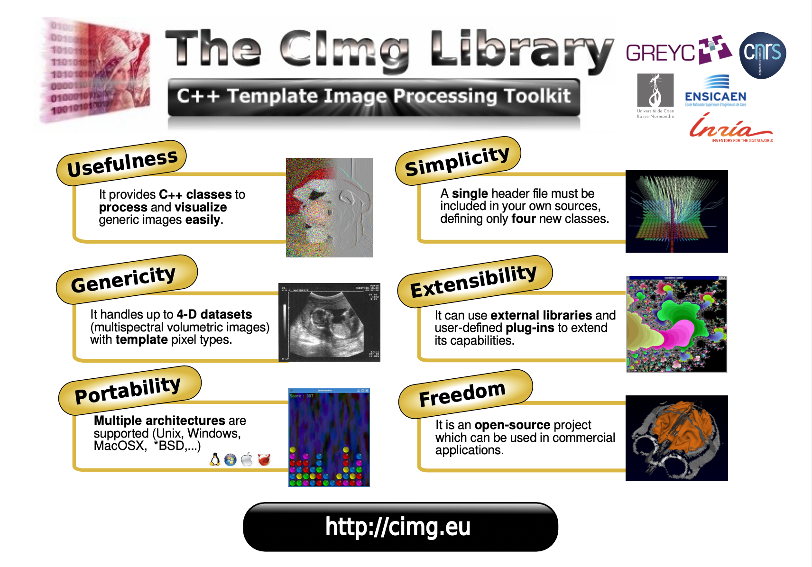
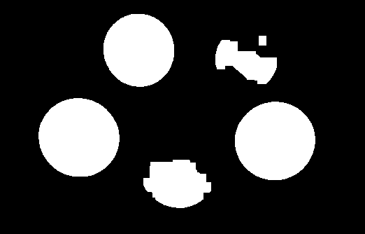
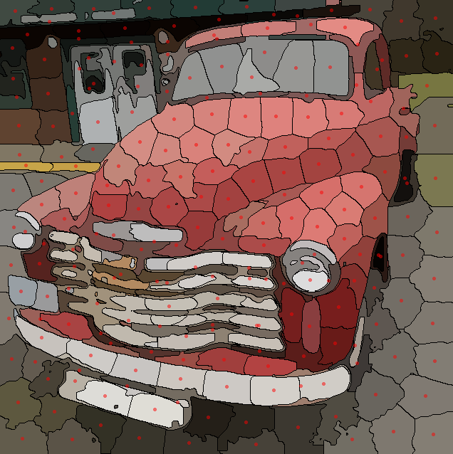
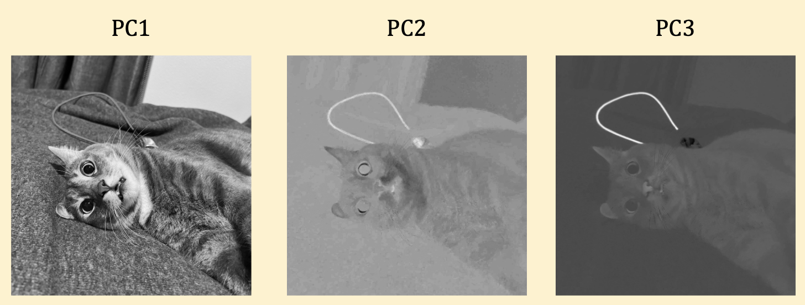

# Digital Image Processing
I've set up this repo to dig deeper into image processing algorithms, using C++ and the CImg Library. College courses only scratch the surface of what's out there, so this project is my way of diving in and getting hands-on with C++. 

I'm using the book [*Digital Image Processing with C++: Implementing Reference Algorithms with the CImg Library* by Tschumperlé, Tilmant, Barra](https://www.amazon.com/Digital-Image-Processing-Implementing-Algorithms/dp/1032347538) as my primary reference.

## Introduction
I used to rely on OpenCV for image processing tasks. It's undoubtedly powerful, but getting it set up on a new computer was always a bit of a headache. Also, it has so many features that it was hard to keep track of everything.

Then I discovered CImg, a streamlined library that encapsulates everything in a single header file. That means you can just drop it into your project and get going. I'll be sharing what I learn as I go along, so check out my [study notes](https://tonyfu97.github.io/Digital-Image-Processing/) if you're interested.

## References
Here are some key resources that guided this project:
- **Primary Reference**: [*Digital Image Processing with C++: Implementing Reference Algorithms with the CImg Library* by Tschumperlé, Tilmant, Barra](https://www.amazon.com/Digital-Image-Processing-Implementing-Algorithms/dp/1032347538)
- [CImg Library](http://cimg.eu/)
- [*Principles of Digital Image Processing* series by Burger &amp; Burge (2009, 2013)](https://imagingbook.com/books/englisch-edition-3-vol-softcover/)

## Core Concepts

| Chapter | Topic | Key Ideas |
|---------|-------|-----------|
| 1 | [Getting Started](./01_getting_started/) | Installation, hello world, and `CImgDisplay` |
| 2 | [Block Decomposition](./02_block_decomposition/) | `CImg` template class, reading command-line parameters, get vs. non-get methods, block decomposition, loops in CImg, draw methods |
| 3 | [Point Processing Transformations](./03_point_processing/) | Mathematical transformations, bitwise transformations, histogram equalization |
| 4 | [Mathematical Morphology](./04_mathematical_morphology/) | Dilation, erosion, opening, closing, Kramer-Bruckner, Alternating Sequential Filters (ASF), morphological gradients, Beucher gradient, skeletonization |
| 5 | [Filtering](./05_filtering/) | Convolution, median filter, first-order derivative, second-order derivative, adaptive filters, adaptive window filters, frequency-domain filtering, diffusion filtering | 
| 6 | [Feature Extraction](./06_feature_extraction/) | Harris-Stephens corner detection, Shi-Tomasi algorithm, Hough transform, texture spectrum, Tamura texture coefficients, Local Binary Patterns (LBP) |
| 7 | [Segmentation](./07_segmentation/) | Active contours, Ostu's algorithm, Bernsen's algorithm, K-means clustering, Simple Linear Iterative Clustering (SLIC) |
| 8  | [Motion Estimation](./08_motion/) | Horn-Schunck optical flow, multiscale analysis, Lucas-Kanade optical flow, eigenelement analysis, cross-correlation, phase correlation, Kalman filter |
| 9 | [Multispectral Image Processing](./09_multispectral/) | Principal Component Analysis (PCA), median filtering in color images, color spaces |
| 10 | [3D Visualization](./10_3d/) | |
| Appendix 1| [Math Expressions in CImg's Fill Method](./appendix_1/) | How to write math expression for `CImg<>::fill()` |
| Appendix 2| [JPEG Compression](./appendix_2/) | |
