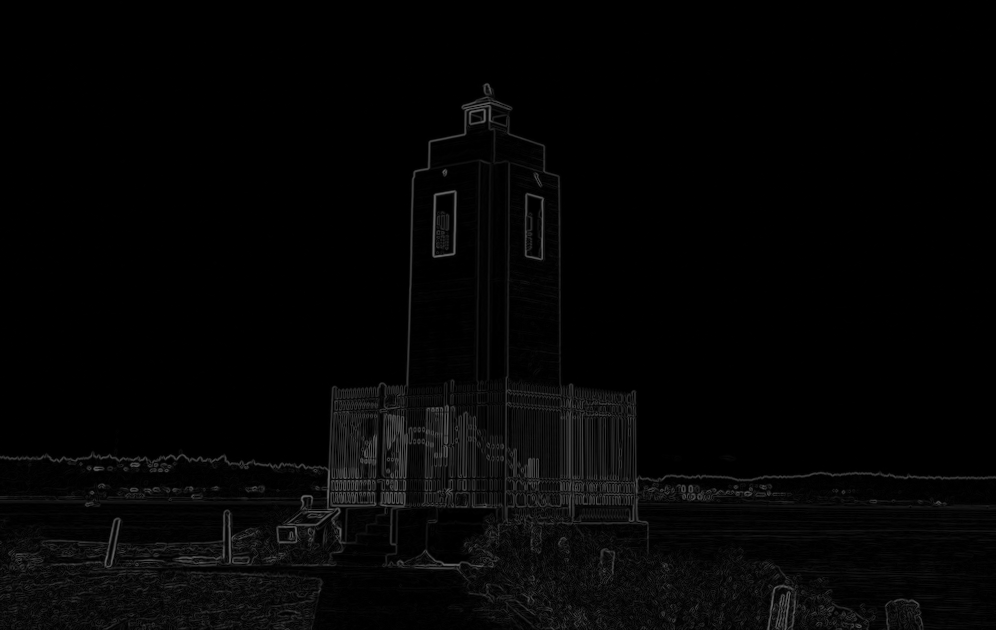
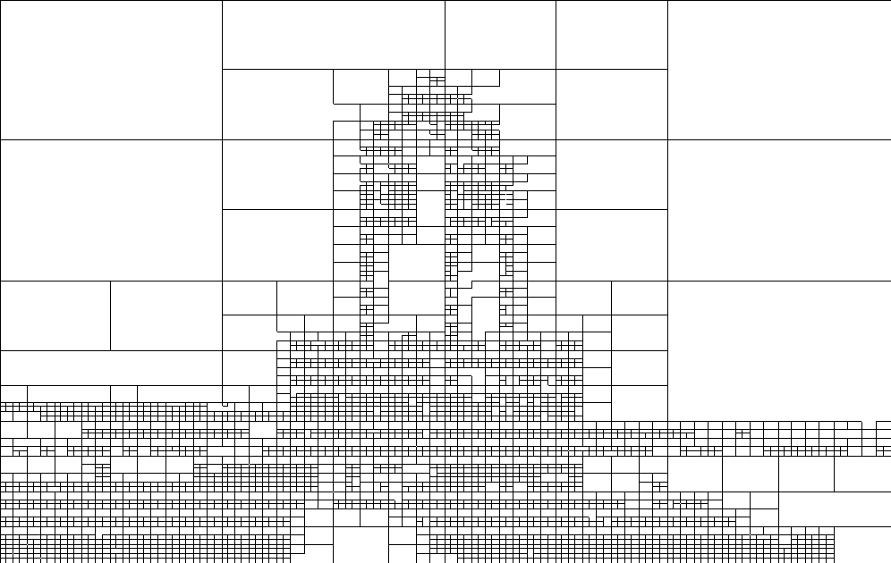

# Block Decomposition - Learning Reflection

**Author**: Tony Fu  
**Date**: August 18, 2023  
**Device**: MacBook Pro 16-inch, Late 2021 (M1 Pro)  
**Reference**: Chapter 2.3 - 2.7 [*Digital Image Processing with C++: Implementing Reference Algorithms with the CImg Library* by Tschumperlé, Tilmant, Barra](https://www.amazon.com/Digital-Image-Processing-Implementing-Algorithms/dp/1032347538)

## 1. `CImg` Template Class

The `CImg` library is a template-based image manipulation library, and its template argument specifies the pixel type. By default, if you don't specify the template argument, it's instantiated with `float`.

So when you declare an image like this:

```cpp
CImg<> img("image.png");
```

It is equivalent to:

```cpp
CImg<float> img("image.png");
```

You can specify a different type if you want, such as `unsigned char`, `int`, etc. But if you simply use `CImg<>`, then it defaults to using `float`.

Below are some commonly used constructors for [`CImg<T>`](https://cimg.eu/reference/structcimg__library_1_1CImg.html):

* **Default Constructor**: 
```cpp
CImg<T>();
```
This constructs an empty image.

* **Constructor with Dimensions**:
```cpp
CImg<T>(const unsigned int width, const unsigned int height, const unsigned int depth = 1, const unsigned int spectrum = 1, const T& value = 0);
```
    * `width`: Width of the image.
    * `height`: Height of the image.
    * `depth`: Depth of the image (default is 1 for 2D images).
    * `spectrum`: Number of channels (e.g., 3 for RGB image).
    * `value`: Initial value for all pixels.


* **Copy Constructor**:
```cpp
CImg<T>(const CImg<T>& img);
```
Constructs a copy of the given image `img`.

* **Constructor from File**:
```cpp
CImg<T>(const char* filename);
```
Constructs an image by reading from a file specified by `filename`.

* **Constructor from Data**:
```cpp
CImg<T>(const T* data, const unsigned int width, const unsigned int height, const unsigned int depth = 1, const unsigned int spectrum = 1, const bool shared = false);
```
    * `data`: Pointer to pixel data.
    * `width`, `height`, `depth`, `spectrum`: Same as above.
    * `shared`: If `true`, the data is shared with the original pointer without making a separate copy.

* **Constructor from Expression**:
```cpp
CImg<T>(const char* expression, const char* variable_name = 0, const T& variable_value = 0, const char* variable_name1 = 0, const T& variable_value1 = 0);
```
This constructor creates an image from a mathematical expression, allowing for variable substitutions.


## 2. Reading Command-Line Parameters

The `cimg_usage()` and `cimg_option()` functions are used to handle command-line arguments. Here's a brief description of each function:

1. **`cimg_usage(const char *const format, ...)`:** This function is typically used to print a description of your program when it's invoked from the command line.

2. **`cimg_option(const char *const opt, type_def variable, const char *const format, ...)`:** This function is a command-line option parser. It's used to handle options passed to your program when it's invoked from the command line. Here's a breakdown of the parameters:
   - `opt`: the name of the command-line option.
   - `variable`:  the default value that will be assigned to the variable if the corresponding command-line option is not provided.
   - `format`: a string that may contain a description of what the option does (this will be printed if a specific help option is invoked, like `--help`).

Here's a simple example showing how you might use these functions:

```cpp
#include "CImg.h"

int main(int argc, char **argv) {
    cimg_usage("My simple program that does XYZ.");
    int my_option1 = cimg_option("-o1", 0, "An optional parameter that affects behavior.");
    int my_option2 = cimg_option("-o2", 99, "Another optional parameter that affects behavior.");
    // Rest of the program
}
```

If the user runs the program with the options, like `./my_program -o1 5`, the `my_option1` variable will be set to `5`, and the `my_option2` variable will be set to the default value of `99`.

If they run the program with the `--help` option, they will see the usage string followed by the options descriptions.

## 3. Get vs. Non-Get Methods in Image Processing with CImg

In image processing using CImg, it's really helpful to know whether a method is going to give you a new object (a get method) or change the one you already have (a non-get method). CImg has both types for most of its methods:

* **Get Methods**: These create a new object with the changes you want, leaving the one you started with the same. Like `CImg<float>::get_blur()`, which makes a new blurred image but doesn't touch the original.
* **Non-get Methods**: These change the object you call them on and usually give you back a reference to that changed object. For example, `CImg<float>::blur()` changes the image and gives you back a reference to it.

Here's an example to show how this works:

```cpp
CImg<> lum = img.get_norm().blur(sigma).normalize(0, 255);
```

In this code, `get_norm` makes a new image (make it gray-scale by taking the L2-norm of the RGB channel), and `blur` and `normalize` change it and give you back references. This way of doing things makes it easy to chain operations together and save memory.

**Resutls:**

* Original Image
 

* Luminance Image


## 4. Gradient Magnitude Computation

Gradient is computed using the [`get_gradient()`](https://cimg.eu/reference/structcimg__library_1_1CImg.html#a0f7d2161b942a08e4575451de817227d) method. The gradient is computed using the *centered finite differences* by default. We will discuss the spatial filtering in Chapter 5. The method returns a `CImgList` object, which is a list of images in the order you specify. In this case, we want the gradient in the x and y directions, so we specify `"xy"` as the argument.

```cpp
CImgList<> grad = lum.get_gradient("xy");
```

Then we compute the gradient magnitude using the following formula:
$$
\|\nabla I\| = \sqrt{G_x^2 + G_y^2}
$$

```cpp
CImg<> normGrad = (grad[0].get_sqr() += grad[1].get_sqr()).sqrt();
```

Notice the use of the "non-get" `+=` operator, which prevents the creation of an unnecessary temporary image.

**Results:**

* Gradient Magnitude Image


## 5. Block Decomposition

See **Algorithm 1** in the book for the pseudocode. Here's my breakdown:

1. **Accessing the Current Block**: The loop iterates through a list of blocks (`blocks`), where each block is represented by a `CImg<int>` object containing four integers representing the coordinates of the top-left and bottom-right corners of the block (x0, y0) and (x1, y1). (Yes, `CImg` can be used as 1D vectors using `CImg<int>::vector()`.

2. **Checking Conditions**: For each block, the code checks two conditions:
   (a) If the maximum value of the `normGrad` image, when cropped to the current block, is greater than a given threshold.
   (b) If both the width and height of the block are greater than 8.

3. **Splitting the Block**: If both conditions are met, the block is divided into four equal parts. The new blocks are created by calculating the midpoint of the original block (xc, yc) and using these coordinates to define the four new blocks.

4. **Updating the List of Blocks**: The four new blocks are added to the `blocks` list using the `move_to()` method to avoid creating unnecessary copies. The original block is then removed from the list using the `remove()` method.

5. **Continuing Iteration**: If the conditions are not met, the loop simply moves on to the next block by incrementing the index `l`.


## 6. Loop Iteration in CImg

The following macros greatly simplify writing loops that iterate over various parts of an image:

* **cimg_for(img,ptr,T)**: Iterates over all pixels of an image.
```cpp
cimg_for(img, ptr, T) {
    // Do something with ptr, a pointer to the pixel value.
}
```

* **cimg_forX(img,x)**: Iterates over the width of an image.
```cpp
cimg_forX(img, x) {
    // x is the x-coordinate, ranging from 0 to img.width() - 1.
}
```
For macro `cimg_forX(img,x)`, you do not need to declare `x` as an integer before using it in the loop. The macro itself takes care of that. If there is already a variable named `x` in the same scope where you're using this macro, you can place the code inside a different scope.

* **cimg_forY(img,y)**: Iterates over the height of an image.
```cpp
cimg_forY(img, y) {
    // y is the y-coordinate, ranging from 0 to img.height() - 1.
}
```

* **cimg_forZ(img,z)**: Iterates over the depth of an image (for 3D images).
```cpp
cimg_forZ(img, z) {
    // z is the z-coordinate, ranging from 0 to img.depth() - 1.
}
```

* **cimg_forC(img,c)**: Iterates over the channels (spectrum) of an image.
```cpp
cimg_forC(img, c) {
    // c is the channel index, ranging from 0 to img.spectrum() - 1.
}
```

* **cimg_forXY(img,x,y)**: Iterates over both the width and height of an image.
```cpp
cimg_forXY(img, x, y) {
    // Do something with x and y coordinates.
}
```

* **cimg_forXYZ(img,x,y,z)**: Iterates over width, height, and depth of a 3D image.
```cpp
cimg_forXYZ(img, x, y, z) {
    // Do something with x, y, and z coordinates.
}
```

* **cimg_forXYZC(img,x,y,z,c)**: Iterates over all dimensions, including channels.
```cpp
cimg_forXYZC(img, x, y, z, c) {
    // Do something with x, y, z coordinates and channel c.
}
```

## 7. Drawing Blocks

`blocks` is a vector of `(x0, y0, x1, y1)` coordinates. In the following code, we iterate through each block. We use `get_crop()` and `resize()` the cropped image to 1x1 pixels, which is the average color of the block. Then we draw a rectangle using the `draw_rectangle()` method.

```cpp
// Rendering of the decomposition.
CImg<unsigned char> res(img.width(), img.height(), 1, 3, 0);
CImg<int> coords(img.width(), img.height(), 1, 4, 0);
cimglist_for(blocks, l)
{
    CImg<int> &block = blocks[l];
    int
        x0 = block[0],
        y0 = block[1],
        x1 = block[2],
        y1 = block[3];
    CImg<unsigned char> color = img.get_crop(x0, y0, x1, y1).resize(1, 1, 1, 3, 2);
    res.draw_rectangle(x0, y0, x1, y1, color.data(), 1);
    coords.draw_rectangle(x0, y0, x1, y1, block.data());
}
```

There are two `CImg` objects here:

* `res`: This is the final image that will be displayed. It is initialized to all black pixels.
* `coords`: This maps each pixel to the block it belongs to. It will be used later for user interaction.

```cpp
// Adding black borders.
res.mul(1 - (res.get_shift(1, 1, 0, 0, 0) - res).norm().cut(0, 1));
```
This above is a clever way to add black borders:

### Part 1: Edge Detection
The first part of the expression is a kind of high-pass edge detection filter that calculates the difference between adjacent pixels in the image, thereby emphasizing sharp changes or edges. The expression for this part is:

$$
\text{mask}(x, y) = \left(1 - \min\left(1, \max\left(0, \|res(x, y) - res(x - 1, y - 1)\|\right)\right)\right)
$$

Here, \(\|res(x, y) - res(x - 1, y - 1)\|\) calculates the difference between adjacent pixels. By using the `min` and `max` functions, this difference is clipped to the range \([0, 1]\), with 0 representing no change (no edge) and 1 representing a large change (an edge).

* `res`


* `mask`


### Part 2: Multiplication
The second part of the expression involves multiplying the original pixel value with the edge value obtained in Part 1. This has the effect of enhancing the detected edges in the image. The expression for this part is:

$$\text{result}(x, y) = res(x, y) \cdot \text{mask}(x, y)$$

* Block Decomposition


The book also propose two other ways to render the borders: `CImg<unsigned char>::fill()` and `cimg_for3x3`.

## 8. GUI

The `CImgDisplay` class is used to create a window and display an image. It has the following constructor:

```cpp
CImgDisplay disp(const CImg<T>& img, const char* title = 0, const int normalization_type = 3);
```

The normalization type is used to specify how the image is normalized when displayed. The following table shows the different options:

| Normalization Value | Description |
|---------------------| ------------|
| 0                   | No normalization applied. |
| 1                   | Automatic linear normalization to the \([0, 255]\) range.|
| 2                   | A one-time linear normalization with parameters calculated at the first display. These are then reused for subsequent images in the same window. Ideal for preserving consistent gray levels.|
| 3                   | Default automatic mode, with behavior depending on the type.|

The following code creates a window and displays the image `res`:

```cpp
// Start the interactive viewer.
CImgDisplay disp(res, "CImg Tutorial: Block Decomposition", 0);
unsigned char white[] = {255, 255, 255}, black[] = {0, 0, 0};
while (!disp.is_closed() && !disp.is_keyESC())
{
    int
        x = disp.mouse_x(),
        y = disp.mouse_y();
    if (x >= 0 && y >= 0)
    {
        // Get the coordinates of the block under the mouse position.
        int
            x0 = coords(x, y, 0),
            y0 = coords(x, y, 1),
            x1 = coords(x, y, 2), y1 = coords(x, y, 3),
            xc = (x0 + x1) / 2, yc = (y0 + y1) / 2;

        // Get the block and its gradient.
        CImg<unsigned char>
            pImg = img.get_crop(x0, y0, x1, y1).resize(128, 128, 1, 3, 1),
            pGrad = normGrad.get_crop(x0, y0, x1, y1).resize(128, 128, 1, 3, 1).normalize(0, 255).map(CImg<unsigned char>::hot_LUT256());

        // Display the block and its gradient.
        (+res).
        draw_text(10, 3, "X, Y = %d, %d", white, 0, 1, 24, x, y).
        draw_rectangle(x0, y0, x1, y1, black, 0.25f).
        draw_line(74, 109, xc, yc, white, 0.75, 0xCCCCCCCC).
        draw_line(74, 264, xc, yc, white, 0.75, 0xCCCCCCCC).
        draw_rectangle(7, 32, 140, 165, white).
        draw_rectangle(7, 197, 140, 330, white).
        draw_image(10, 35, pImg).
        draw_image(10, 200, pGrad).
        display(disp);
    }
    disp.wait(); // Wait for an user event
    if (disp.is_resized())
        disp.resize(disp);
}
```

Read a book for more details. Note that `(+res)` is a trick used to make a copy of the image `res` without creating a new object.

