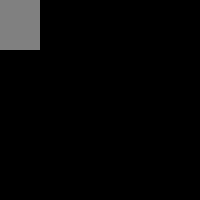

# Point Processing Transformations - Learning Reflection

**Author**: Tony Fu  
**Date**: August 19, 2023  
**Device**: MacBook Pro 16-inch, Late 2021 (M1 Pro)  
**Reference**: Chapter 3 [*Digital Image Processing with C++: Implementing Reference Algorithms with the CImg Library* by Tschumperlé, Tilmant, Barra](https://www.amazon.com/Digital-Image-Processing-Implementing-Algorithms/dp/1032347538)


## 1. Mathematical Transformations

### 1.0. Orignal Image


### 1.1. Exponential Transformations

```cpp
CImg<> expImg = lum.get_exp()/50;
```


### 1.2. Square Root Transformations

```cpp
CImg<> sqrtImg = lum.get_sqrt()*10;
```


### 1.3. Logarithmic Transformations

```cpp
CImg<> logImg = (2 + lum.get_abs()).log();
```


### 1.4 Cube Transformations

```cpp
CImg<> cubeImg = lum.get_pow(3);
```


## 2. Bitwise Transformations

### 2.0. Orignal Images


### 2.1. Bitwise AND

```cpp
CImg<unsigned char> img_and = img1 & img2;
```


If you have two 8-bit pixels, one with the value 0101 (5 in decimal) and the other with 1010 (10 in decimal), then the bitwise AND operation between these two pixels would give you 0000 (0 in decimal).

### 2.2. Bitwise OR

```cpp
CImg<unsigned char> img_or = img1 | img2;
```


### 2.3. Bitwise XOR

```cpp
CImg<unsigned char> img_xor = img1 ^ img2;
```


As we seen in the above example, bitwise operations might seem somewhat abstract when applied to images (5 & 10 = 0. What?), but they are actually quite useful in in specific contexts:

* **Masking**: If you have a binary mask where certain pixels are set to 1 and others are set to 0, you can use the bitwise AND operation with an image to "mask" or isolate those areas. 
* **Steganography or Watermarking**: Bitwise operations might be used to embed or extract information within an image. By operating at the bit level, you can hide data within the least significant bits of an image in a way that's almost visually imperceptible. Refer to Code 3.3 in the book for an example.
* **Thresholding**: If you have two binary images representing different thresholded features, the bitwise AND can be used to find the overlapping areas between those features.

## 3. Histogram Equalization

### 3.0. Orignal Image


And the corresponding histogram:


### 3.1. Histogram Equalization

```cpp
CImg<> equalizeHisto(CImg<> &imgIn, unsigned int nb)
{
    CImg<> imgOut(imgIn);                   // Create a copy of the input image for the output
    float vmin, vmax = imgIn.max_min(vmin); // Find the minimum and maximum pixel values
    int size = imgIn.size();                // Get the total number of pixels in the image
    int vdiff = vmax - vmin;                // Compute the difference between max and min values

    CImg<> hist = imgIn.get_histogram(nb, vmin, vmax); // Calculate the histogram with nb bins
    long int cumul = 0;

    // Compute the cumulative histogram
    cimg_forX(hist, pos)
    {
        cumul += hist[pos];
        hist[pos] = cumul;
    }

    if (cumul == 0) // Check for a special case where the image has no non-zero pixels
        cumul = 1;  // Avoid division by zero later in the code

    // Equalize the image by adjusting pixel values according to the cumulative histogram
    cimg_foroff(imgIn, off) // Iterate through all offsets (positions) in the input image
    {
        int pos = (int)((imgIn[off] - vmin) * (nb - 1) / vdiff);
        if (pos >= 0 && pos < (int)nb)
            imgOut[off] = vmin + vdiff * hist[pos] / size;
    }

    return imgOut;
}
```

In the example code above, `cimg_foroff` is a macro provided by the CImg library that creates a loop to iterate over all the pixels in the image. Inside this loop, we first calculate the position of the pixel in the histogram (`pos`).

$$
\text{{pos}} = \left\lfloor \frac{{(I_{\text{{off}}} - \text{{vmin}}) \cdot (\text{{nb}} - 1)}}{{\text{{vdiff}}}} \right\rfloor
$$

where \(I_{\text{{off}}}\) is the intensity of the pixel at offset `off`, \(\text{{vmin}}\) and \(\text{{vmax}}\) are the minimum and maximum intensity values in the image, \(\text{{vdiff}} = \text{{vmax}} - \text{{vmin}}\), and \(\text{{nb}}\) is the number of bins in the histogram.

Then, we check if the position is within the valid range of the histogram:
$$
\text{if } \text{{pos}} \geq 0 \text{ and } \text{{pos}} < \text{{nb}}
$$

If so, we calculate the new pixel value using the following expression:

$$
I_{\text{{out, off}}} = \text{{vmin}} + \frac{{\text{{vdiff}} \cdot H_{\text{{pos}}}}}{{\text{{size}}}}
$$

where \(I_{\text{{out, off}}}\) is the new intensity value at offset `off`, \(H_{\text{{pos}}}\) is the value at the `pos` position in the cumulative histogram, and \(\text{{size}}\) is the total number of pixels in the image.


And the corresponding histogram:
