# Mathematical Morphology - Learning Reflection

**Author**: Tony Fu  
**Date**: August 19, 2023  
**Device**: MacBook Pro 16-inch, Late 2021 (M1 Pro)  
**Reference**: Chapter 4 [*Digital Image Processing with C++: Implementing Reference Algorithms with the CImg Library* by Tschumperlé, Tilmant, Barra](https://www.amazon.com/Digital-Image-Processing-Implementing-Algorithms/dp/1032347538)

## 1. Erosion and Dilation

I found the book's explanation of erosion and dilation to be a bit confusing. I would recommend watching [this video](https://youtu.be/rP1KZb3llCY) for a more intuitive explanation of the concepts.

Mathematical morphology operations have a straightforward definition when dealing with binary images. For grayscale images, the definitions become more complex:

### Binary Images

For binary images \(A\) and a structuring element \(B\), the operations can be defined as follows:

1. **Dilation**:
   \[ (A \oplus B)(x,y) = \max \{ A(x-i, y-j) \cdot B(i,j) : (i,j) \in \text{{domain of }} B \} \]

2. **Erosion**:
   \[ (A \ominus B)(x,y) = \min \{ A(x+i, y+j) \cdot B(i,j) : (i,j) \in \text{{domain of }} B \} \]


### Gray-Level Images

For grayscale images \(A\) and a structuring element \(B\), the definitions change slightly:

1. **Dilation**:
   \[ (A \oplus B)(x,y) = \max \{ A(x-i, y-j) + B(i,j) : (i,j) \in \text{{domain of }} B \} \]

Dilation causes bright regions to expand and dark regions to contract.

2. **Erosion**:
   \[ (A \ominus B)(x,y) = \min \{ A(x+i, y+j) - B(i,j) : (i,j) \in \text{{domain of }} B \} \]

Erosion causes bright regions to contract and dark regions to expand.

In CImg, we can perform erosion and dilation using the `erode()` and `dilate()` functions. Both functions take a structuring element `B` as an argument.

```cpp
CImg<unsigned char> img("coins.png");
CImg<> lum = img.get_norm().blur(0.75f);
lum.threshold(lum.median()).normalize(0, 255);

CImg<unsigned char> B = CImg<unsigned char>(3, 3).fill(1);
CImg<unsigned char>
    imgErode = lum.get_erode(B),   // Erosion
    imgDilate = lum.get_dilate(B); // Dilation"
```
- **Original**:


- **Binarized Luminance**:


- **Then Apply Erosion**: 


- **... or Dilation**: 


## 2. Opening and Closing

The opening and closing operations are defined as follows (works for both binary and grayscale images):

1. **Opening**:
   \[ A \circ B = (A \ominus B) \oplus B \]

2. **Closing**:
   \[ A \bullet B = (A \oplus B) \ominus B \]

```cpp
CImg<unsigned char> B = CImg<unsigned char>(3, 3).fill(1);
CImg<unsigned char>
    imgErode = lum.get_erode(B),   // Erosion
    imgDilate = lum.get_dilate(B), // Dilation"
    imgOpen = imgErode.get_dilate(B), // Opening
    imgClose = imgDilate.get_erode(B); // Closing
```

- **Opening**: Erode, then dilate (removes small objects and smooths larger ones)

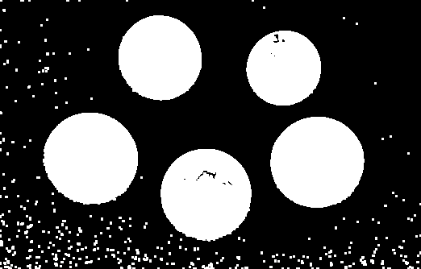

- **Closing**: Dilate, then erode (closes small holes and joins nearby objects)

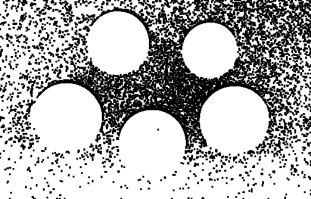


## 3. Kramer-Bruckner Filter

The Kramer-Bruckner filter is a specific morphological filter used to enhance contrast and reduce noise in an image. It performs a combination of dilation and erosion, typically using a circular structuring element. In math, it can be expressed as the following two formulas:

1. Compute the mid-value \( M \) for each pixel:
   \[
   M(x,y) = 0.5 \times \left( (A \ominus B)(x,y) + (A \oplus B)(x,y) \right)
   \]

2. Assign the output image values based on the input image and mid-value:
   \[
   A_{\text{out}}(x,y) = \begin{cases} 
      (A \ominus B)(x,y) & \text{if } A(x,y) \leq M(x,y) \\
      (A \oplus B)(x,y) & \text{if } A(x,y) > M(x,y) 
   \end{cases}
   \]

Here, \( A \) is the input image, \( B \) is the structuring element, \( \ominus \) denotes erosion, and \( \oplus \) denotes dilation.

```cpp
CImg<> KramerBruckner(CImg<> &imgIn, int n)
{
    CImg<>
        imgOut(imgIn),
        mask = CImg<>(n, n).fill(1),
        imgErode = imgIn.get_erode(mask),
        imgDilate = imgIn.get_dilate(mask); // Dilation
    cimg_forXY(imgOut, x, y)
    {
        float M = 0.5f * (imgErode(x, y) + imgDilate(x, y));
        imgOut(x, y) = (imgIn(x, y) <= M ? imgErode(x, y) : imgDilate(x, y));
    }
    return imgOut;
}
```


## 4. Alternating Sequential Filters (ASF):
Alternating Sequential Filters are a series of morphological operations that are applied sequentially, often involving both erosions and dilations with increasing sizes of structuring elements.

* **ASF (n = 1)**: Erosion, then dilation


* **ASF (n = 3)**: (Erosion, then dilation) * 3


* **ASF (n = 11)**:

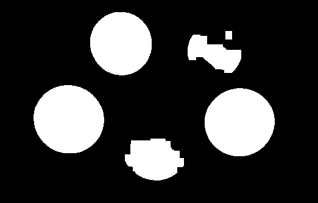


## 5. Other Morphological Operations

### 1. Morphological Gradients
Morphological gradients measure the difference between dilation and erosion of an image. In this code, two gradients are computed: the erosion gradient and the dilation gradient.

- Erosion Gradient (\( \text{gradE} \)): \( \text{gradE} = A - (A \ominus B) \)
- Dilation Gradient (\( \text{gradD} \)): \( \text{gradD} = (A \oplus B) - A \)

Gradient E:

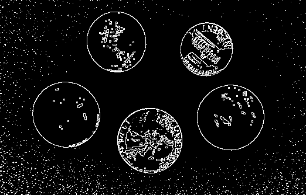

Gradient D:

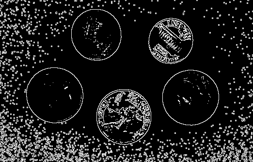

### 2. Beucher Gradient
The Beucher gradient is another way of expressing the difference between dilation and erosion. It's calculated as the difference between the dilated and eroded images.

- Beucher Gradient: \( \text{imgBeucher} = (A \oplus B) - (A \ominus B) \)


### 3. Top Hat Transformations
Top hat transformations emphasize differences between the original image and its morphological opening or closing.

- White Top Hat: \( \text{whiteTopHat} = A - (A \ominus B) \oplus B = A - A \circ B\)
- Black Top Hat: \( \text{blackTopHat} = (A \oplus B) \ominus B - A = A \bullet B - A\)

White Top Hat:

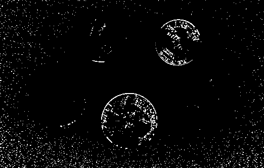

Black Top Hat:

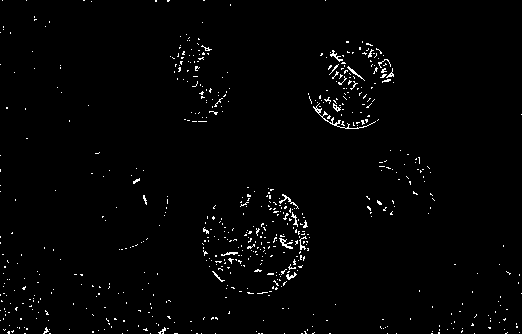


### 4. Edge Detector (contourMin and contourMax)
These operations compute the minimum and maximum between the erosion and dilation gradients, respectively.

- Contour Min: \( \text{contourMin} = \min(\text{gradE}, \text{gradD}) \)
- Contour Max: \( \text{contourMax} = \max(\text{gradE}, \text{gradD}) \)

Contour Min (this is blank because there is no overlap between `gradE`and `gradD`)

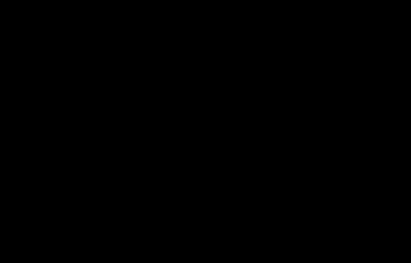

Contour Max:


### 5. Nonlinear Laplacian
The nonlinear Laplacian is the difference between the dilation and erosion gradients.

- Nonlinear Laplacian: \( \text{Laplician} = \text{gradD} - \text{gradE} \)

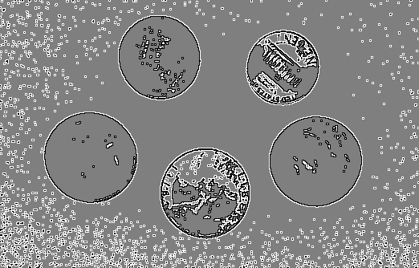

### 6. Skeletonization

Here we implement the [Zhang-Suen skeletonization algorithm](http://agcggs680.pbworks.com/f/Zhan-Suen_algorithm.pdf) using the CImg library in C++. **Very Important Note**: this method requires that the input image is binary (i.e., pixels are either 0 or 1).

#### Iterative Skeletonization Function

The main function for skeletonization is `IterSkeleton`. This function takes a binary image as input and performs two passes, removing certain edge pixels in each pass.

#### Initializing Variables

```cpp
CImg<unsigned char> D(imgIn.width(), imgIn.height(), 1, 1, 0);
CImg_3x3(N, unsigned char);
```

Here, we use `D` to tag pixels for removal. Whenever a pixel is tagged, we set its value to 1.

Note that `CImg_3x3` has the macro format `CImg_3x3(I,T)`:

```cpp
#define CImg_3x3(I,T) T I[9]; \
        T& I##pp = I[0]; T& I##cp = I[1]; T& I##np = I[2]; \
        T& I##pc = I[3]; T& I##cc = I[4]; T& I##nc = I[5]; \
        T& I##pn = I[6]; T& I##cn = I[7]; T& I##nn = I[8]; \
        I##pp = I##cp = I##np = \
        I##pc = I##cc = I##nc = \
        I##pn = I##cn = I##nn = 0
```
So that in the subsequent code, we can use `N` to access the 8 neighbors of a pixel. The variables `Npp, Ncp, Nnp, Npc, Nnc, Npn, Ncn, Nnn` represent the 8 neighboring pixels around the central pixel `(x, y)`. The variable names correspond to their relative positions:

  - `Npp`: Previous row, previous column.
  - `Ncp`: Current row, previous column.
  - `Nnp`: Next row, previous column.
  - `Npc`: Previous row, current column.
  - `Nnc`: Next row, current column.
  - `Npn`: Previous row, next column.
  - `Ncn`: Current row, next column.
  - `Nnn`: Next row, next column.
  - The central pixel itself is referred to as `Ncc`.

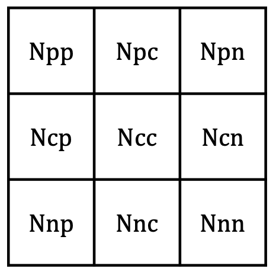

#### Pass 1

The first pass checks each pixel and its 8 neighbors to determine if it should be removed:

\[
B = N_{pp} + N_{cp} + N_{np} + N_{pc} + N_{nc} + N_{pn} + N_{cn} + N_{nn}
\]
\[
C = N_{nc} \cdot (N_{nc} - N_{np}) + N_{np} \cdot (N_{np} - N_{cp}) + \cdots + N_{nn} \cdot (N_{nn} - N_{nc})
\]

Here, `C` is the the number of 0-1 transitions in the 8-neighborhood of the pixel. The book's description "C(N), called connectivity number, expressing how many binary components are connected to the central pixel (x,y)" appears to be incorrect.

The conditions for removal are:

\[
R1 = \left( B \geq 2 \right) \land \left( B \leq 6 \right) \land \left( C = 1 \right) \land \left( N_{cn} \cdot N_{nc} \cdot N_{cp} = 0 \right) \land \left( N_{pc} \cdot N_{cn} \cdot N_{nc} = 0 \right)
\]

Intuitively, this means that the pixel should be removed if:

* It has 2-6 neighbors. (Because if `B` is 0 or 1, then the pixel is an end point or an isolated point.)
* It has exactly 1 0-1 transition in its 8-neighborhood because it is likely to be a boundary pixel.
* **\( N_{cn} \cdot N_{nc} \cdot N_{cp} = 0 \) and \( N_{pc} \cdot N_{cn} \cdot N_{nc} = 0 \) for \( R1 \)**, and **\( N_{nc} \cdot N_{cp} \cdot N_{pc} = 0 \) and \( N_{cp} \cdot N_{pc} \cdot N_{cn} = 0 \) for \( R2 \)**: These are specific conditions for Zhang-Suen thinning. They ensure that no spur pixels (pixels that stick out from the object) are created during the thinning process.

    For \( R1 \), these conditions make sure that the pixel is not an endpoint in the south and east directions, and that removing it won't break connectivity. The conditions for \( R2 \) (see below) do a similar thing, but in the north and west directions. By separating the thinning process into two stages, the algorithm avoids the possibility of over-thinning or under-thinning.


```cpp
// Pass 1
int n1 = 0;
cimg_for3x3(imgIn, x, y, 0, 0, N, unsigned char)
{
    if (imgIn(x, y))
    {
        // Compute B and C here...
        bool R1 = B >= 2 && B <= 6 && C == 1 && Ncn * Nnc * Ncp == 0 && Npc * Ncn * Nnc == 0;
        if (R1)
        {
            // Tag (x,y)
            D(x, y) = 1;
            ++n1;
        }
    }
}
```

#### Removing Tagged Pixels from Pass 1

```cpp
cimg_forXY(imgIn, x, y)
    imgIn(x, y) -= (n1 > 0) * D(x, y);
```

#### Pass 2

The second pass is similar to the first, but with different conditions for removal:

\[
R2 = \left( B \geq 2 \right) \land \left( B \leq 6 \right) \land \left( C = 1 \right) \land \left( N_{nc} \cdot N_{cp} \cdot N_{pc} = 0 \right) \land \left( N_{cp} \cdot N_{pc} \cdot N_{cn} = 0 \right)
\]

#### Removing Tagged Pixels from Pass 2

Similar to the removal in Pass 1.

#### Return the Total Number of Removed Pixels

```cpp
return n1 + n2;
```

#### Iterative Skeletonization

```cpp
int num_removed;
do
{
    num_removed = IterSkeleton(lum);
} while (num_removed > 0);
```

Here, we keep calling `IterSkeleton` until no pixels are removed in a pass.

#### Results

- **Original**:

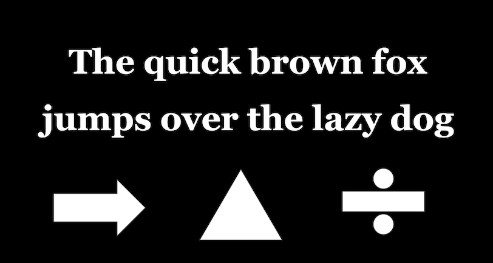

- **Skeleton**:

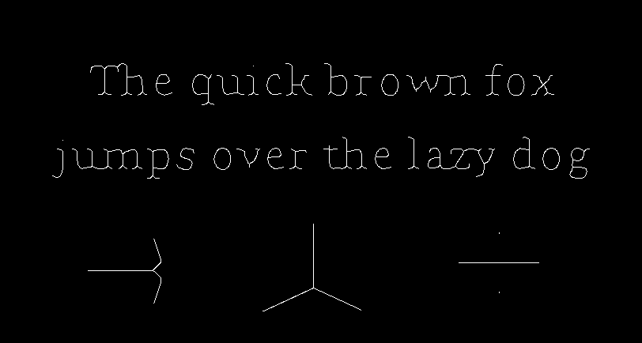
