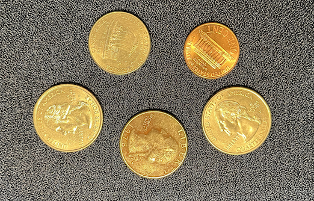
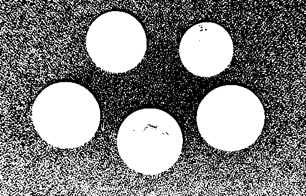
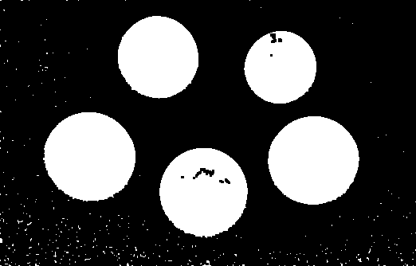
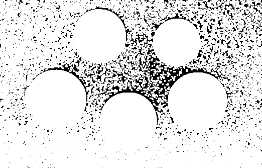

# Mathematical Morphology - Learning Reflection

**Author**: Tony Fu  
**Date**: August 19, 2023  
**Device**: MacBook Pro 16-inch, Late 2021 (M1 Pro)  
**Reference**: Chapter 4 [*Digital Image Processing with C++: Implementing Reference Algorithms with the CImg Library* by Tschumperlé, Tilmant, Barra](https://www.amazon.com/Digital-Image-Processing-Implementing-Algorithms/dp/1032347538)

## 1. Erosion and Dilation

I found the book's explanation of erosion and dilation to be a bit confusing. I would recommend watching [this video](https://youtu.be/rP1KZb3llCY) for a more intuitive explanation of the concepts.

In CImg, we can perform erosion and dilation using the `erode()` and `dilate()` functions. Both functions take a structuring element `B` as an argument.

```cpp
CImg<unsigned char> img("coins.png");
CImg<> lum = img.get_norm().blur(0.75f);
lum.threshold(lum.median()).normalize(0, 255);

CImg<unsigned char> B = CImg<unsigned char>(3, 3).fill(1);
CImg<unsigned char>
    imgErode = lum.get_erode(B),   // Erosion
    imgDilate = lum.get_dilate(B); // Dilation"
```
- **Original**:



- **Binarized Luminance**:



- **Then Apply Erosion**: 



- **... or Dilation**: 



