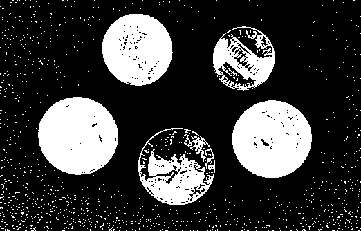
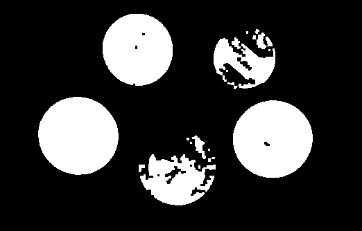

# Mathematical Morphology - Learning Reflection

**Author**: Tony Fu  
**Date**: August 19, 2023  
**Device**: MacBook Pro 16-inch, Late 2021 (M1 Pro)  
**Reference**: Chapter 4 [*Digital Image Processing with C++: Implementing Reference Algorithms with the CImg Library* by Tschumperlé, Tilmant, Barra](https://www.amazon.com/Digital-Image-Processing-Implementing-Algorithms/dp/1032347538)

## 1. Erosion and Dilation

I found the book's explanation of erosion and dilation to be a bit confusing. I would recommend watching [this video](https://youtu.be/rP1KZb3llCY) for a more intuitive explanation of the concepts.

Mathematical morphology operations have a straightforward definition when dealing with binary images. For grayscale images, the definitions become more complex:

### Binary Images

For binary images \(A\) and a structuring element \(B\), the operations can be defined as follows:

1. **Dilation**:
   \[ (A \oplus B)(x,y) = \max \{ A(x-i, y-j) \cdot B(i,j) : (i,j) \in \text{{domain of }} B \} \]

2. **Erosion**:
   \[ (A \ominus B)(x,y) = \min \{ A(x+i, y+j) \cdot B(i,j) : (i,j) \in \text{{domain of }} B \} \]


### Gray-Level Images

For grayscale images \(A\) and a structuring element \(B\), the definitions change slightly:

1. **Dilation**:
   \[ (A \oplus B)(x,y) = \max \{ A(x-i, y-j) + B(i,j) : (i,j) \in \text{{domain of }} B \} \]

Dilation causes bright regions to expand and dark regions to contract.

2. **Erosion**:
   \[ (A \ominus B)(x,y) = \min \{ A(x+i, y+j) - B(i,j) : (i,j) \in \text{{domain of }} B \} \]

Erosion causes bright regions to contract and dark regions to expand.

In CImg, we can perform erosion and dilation using the `erode()` and `dilate()` functions. Both functions take a structuring element `B` as an argument.

```cpp
CImg<unsigned char> img("coins.png");
CImg<> lum = img.get_norm().blur(0.75f);
lum.threshold(lum.median()).normalize(0, 255);

CImg<unsigned char> B = CImg<unsigned char>(3, 3).fill(1);
CImg<unsigned char>
    imgErode = lum.get_erode(B),   // Erosion
    imgDilate = lum.get_dilate(B); // Dilation"
```
- **Original**:


- **Binarized Luminance**:


- **Then Apply Erosion**: 


- **... or Dilation**: 


## 2. Opening and Closing

The opening and closing operations are defined as follows (works for both binary and grayscale images):

1. **Opening**:
   \[ A \circ B = (A \ominus B) \oplus B \]

2. **Closing**:
   \[ A \bullet B = (A \oplus B) \ominus B \]

```cpp
CImg<unsigned char> B = CImg<unsigned char>(3, 3).fill(1);
CImg<unsigned char>
    imgErode = lum.get_erode(B),   // Erosion
    imgDilate = lum.get_dilate(B), // Dilation"
    imgOpen = imgErode.get_dilate(B), // Opening
    imgClose = imgDilate.get_erode(B); // Closing
```

- **Opening**: Erode, then dilate (removes small objects and smooths larger ones)


- **Closing**: Dilate, then erode (closes small holes and joins nearby objects)


## 3. Kramer-Bruckner Filter

The Kramer-Bruckner filter is a specific morphological filter used to enhance contrast and reduce noise in an image. It performs a combination of dilation and erosion, typically using a circular structuring element. In math, it can be expressed as the following two formulas:

1. Compute the mid-value \( M \) for each pixel:
   \[
   M(x,y) = 0.5 \times \left( (A \ominus B)(x,y) + (A \oplus B)(x,y) \right)
   \]

2. Assign the output image values based on the input image and mid-value:
   \[
   A_{\text{out}}(x,y) = \begin{cases} 
      (A \ominus B)(x,y) & \text{if } A(x,y) \leq M(x,y) \\
      (A \oplus B)(x,y) & \text{if } A(x,y) > M(x,y) 
   \end{cases}
   \]

Here, \( A \) is the input image, \( B \) is the structuring element, \( \ominus \) denotes erosion, and \( \oplus \) denotes dilation.

```cpp
CImg<> KramerBruckner(CImg<> &imgIn, int n)
{
    CImg<>
        imgOut(imgIn),
        mask = CImg<>(n, n).fill(1),
        imgErode = imgIn.get_erode(mask),
        imgDilate = imgIn.get_dilate(mask); // Dilation
    cimg_forXY(imgOut, x, y)
    {
        float M = 0.5f * (imgErode(x, y) + imgDilate(x, y));
        imgOut(x, y) = (imgIn(x, y) <= M ? imgErode(x, y) : imgDilate(x, y));
    }
    return imgOut;
}
```




## 4. Alternating Sequential Filters (ASF):
Alternating Sequential Filters are a series of morphological operations that are applied sequentially, often involving both erosions and dilations with increasing sizes of structuring elements.

* **ASF (n = 1)**: Erosion, then dilation


* **ASF (n = 3)**: (Erosion, then dilation) * 3



* **ASF (n = 11)**:


### 5. Morphological Gradient


