# Filtering - Learning Reflection

**Author**: Tony Fu  
**Date**: August 21, 2023  
**Device**: MacBook Pro 16-inch, Late 2021 (M1 Pro)  
**Reference**: Chapter 5 [*Digital Image Processing with C++: Implementing Reference Algorithms with the CImg Library* by Tschumperlé, Tilmant, Barra](https://www.amazon.com/Digital-Image-Processing-Implementing-Algorithms/dp/1032347538)
**Code**: [GitHub](https://github.com/tonyfu97/Digital-Image-Processing/tree/main/05_filtering)

## 1. Convolution

```cpp
CImg<> sobel(3, 3, 1, 1, 0);
sobel(0, 0) = -1; sobel(0, 1) = -2; sobel(0, 2) = -1;
sobel(1, 0) = 0;  sobel(1, 1) = 0;  sobel(1, 2) = 0;
sobel(2, 0) = 1;  sobel(2, 1) = 2;  sobel(2, 2) = 1;
imgIn.convolve(sobel);
```

The above code snippet shows how to perform a convolution on an image with a 3x3 Sobel filter. The result is shown below:

- **Original**:

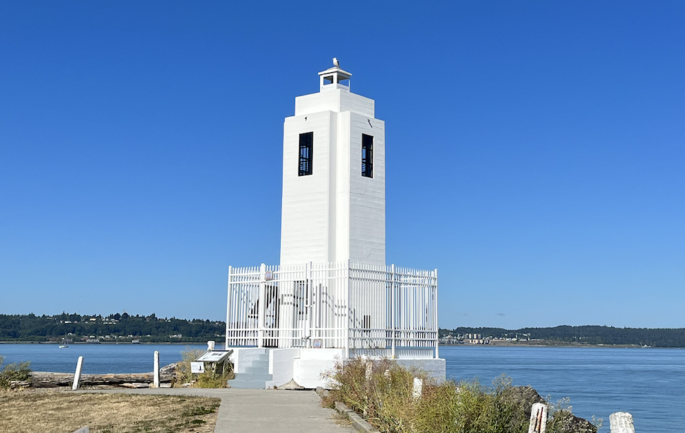

- **Convolution**:

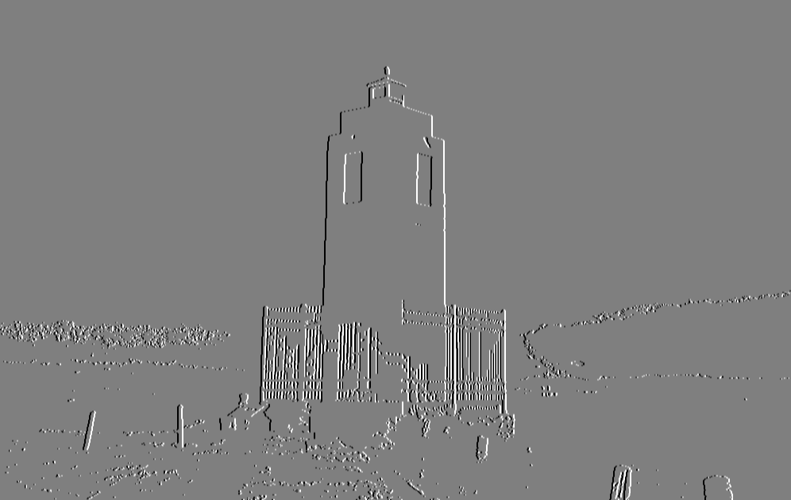


### Boundary Conditions

Boundary conditions specify how to handle the edges and can be specified using the `const usigned int boundary_conditions` parameter of the `convolve()` method. The four boundary conditions provided by the CImg library have specific meanings:

1. **Dirichlet (0):** The pixels outside the image boundaries are considered to be zero. This creates a sort of "hard" edge around the image and can lead to noticeable artifacts along the borders.

2. **Neumann (1) (default):** The value of the border pixels is extended outside the image boundaries. Essentially, this reflects the gradient at the border, assuming that the intensity of the image doesn't change beyond the edge. This is the default boundary condition in CImg and tends to provide visually acceptable results.

3. **Periodic (2):** The image is treated as if it were tiling the plane in a repeated pattern. This means that the pixels on the right edge of the image are used as the boundary condition for the left edge, and the pixels on the bottom are used for the top. This can create seamless transitions but can also lead to strange effects if the image does not naturally tile.

4. **Mirror (3):** The pixels outside the image boundaries are determined by mirroring the pixels inside the boundaries. Imagine folding the image over at its edges, so the pixels just inside the border are duplicated just outside the border. This can create a more visually smooth transition at the edges but may not be appropriate for all types of images.


## 2. Median Fitler

```cpp
img.blur_median(3);
```

The above code snippet shows how to perform a median filter on an image with a 3x3 window. The result is shown below:

- **Origin**:


- **Median Filter**:

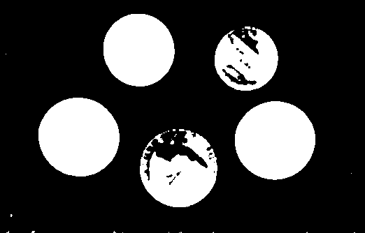


### Order-Statistic (OS) Filter

An [OS filter (Bovik, Huang, and Munson, 1983)](https://ieeexplore.ieee.org/document/1164247) is a non-linear filter that computes a linear combination of these sorted values:

\[ F = w_1 \cdot s_1 + w_2 \cdot s_2 + \ldots + w_n \cdot s_n \]

where \( w_i \) are the weights that define how much each ordered value contributes to the final result, and \( s_i \) are the sorted values of the neighborhood pixels.


## 3. First-Order Derivatives


The `get_gradient` function computes the image gradient along specified axes using different numerical schemes.

### Parameters

- **`axes`**: Axes considered for the gradient computation (e.g., "xy").
- **`scheme`**: Numerical scheme used for the gradient computation. Options are:

### Schemes

1. **Backward Finite Differences (`scheme = -1`)**
   Computes the gradient using backward finite differences:

    \[
    \text{grad}[pos] = \text{data}[pos] - \text{data}[pos - \text{off}]
    \]

2. **Central Finite Differences (`scheme = 0`)**
   Computes the gradient using central finite differences:

    \[
    \text{grad}[pos] = \frac{\text{data}[pos + \text{off}] - \text{data}[pos - \text{off}]}{2}
    \]

3. **Forward Finite Differences (`scheme = 1`)**
   Computes the gradient using forward finite differences:

    \[
    \text{grad}[pos] = \text{data}[pos + \text{off}] - \text{data}[pos]
    \]

4. **Sobel Scheme (`scheme = 2`)**
   Utilizes Sobel operators to compute the gradient.

5. **Rotation Invariant Scheme (`scheme = 3`)**
   Uses a rotation-invariant kernels:

    \[
    \text{Rotation-Invariant}_{x} = \begin{bmatrix} -a & -b & -a \\ 0 & 0 & 0 \\ a & b & a \end{bmatrix}\\
    \text{Rotation-Invariant}_{y} = \text{Rotation-Invariant}_{x}^T
    \]

    where \( a = 0.25 \times (2 - \sqrt{2}) \) and \( b = 0.5 \times (\sqrt{2} - 1) \). 

6. **Deriche Recursive Filter**: Introduced later.
7. **Van Vliet Recursive Filter**: Introduced later.

| Scheme                       | Applications                  | Pros                                     | Cons                                |
|------------------------------|-------------------------------|------------------------------------------|-------------------------------------|
| Backward finite differences  | General-purpose               | Simple, easy to implement                | Less accurate, sensitive to noise   |
| Centered finite differences  | General-purpose               | More accurate than forward/backward      | Sensitive to noise                  |
| Forward finite differences   | General-purpose               | Simple, easy to implement                | Less accurate, sensitive to noise   |
| Using Sobel kernels          | Edge detection                | Good at capturing edges, less noisy      | Can miss fine details               |
| Using rotation invariant     | Edge detection, texture analysis| Rotation invariant, captures subtle edges| More computationally expensive      |
| Using Deriche recursive filter| Smoothing, edge detection     | Smooths noise, good edge detection       | Computationally expensive           |
| Using Van Vliet recursive filter| Smoothing, edge detection    | Smooths noise, efficient computation     | Might blur some edges               |

### Example

```cpp
// Gradient approximation using centered finite differences.
CImgList<> grad = imageIn.get_gradient();

// Norm and phase of the gradient.
CImg<>
    norm = (grad[0].get_sqr() + grad[1].get_sqr()).sqrt(),
    phi = grad[1].get_atan2(grad[0]);
```

- **Original**


- **Gradient X**

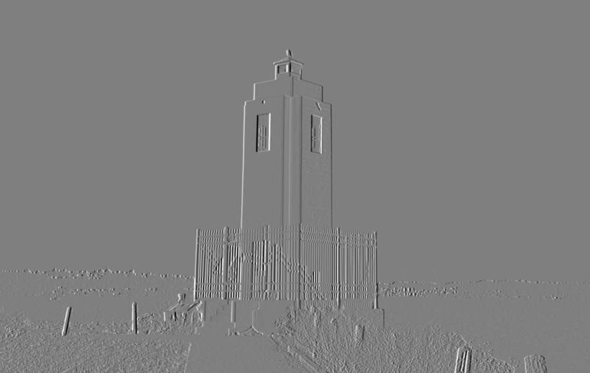

- **Gradient Y**

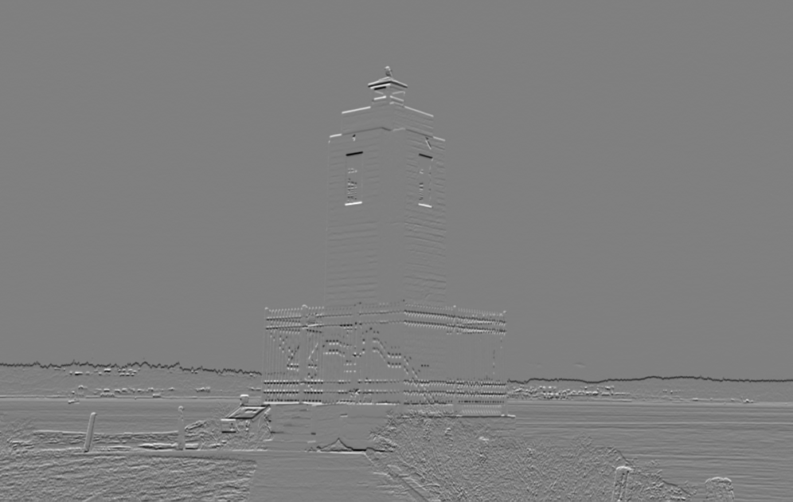

- **Gradient Norm**

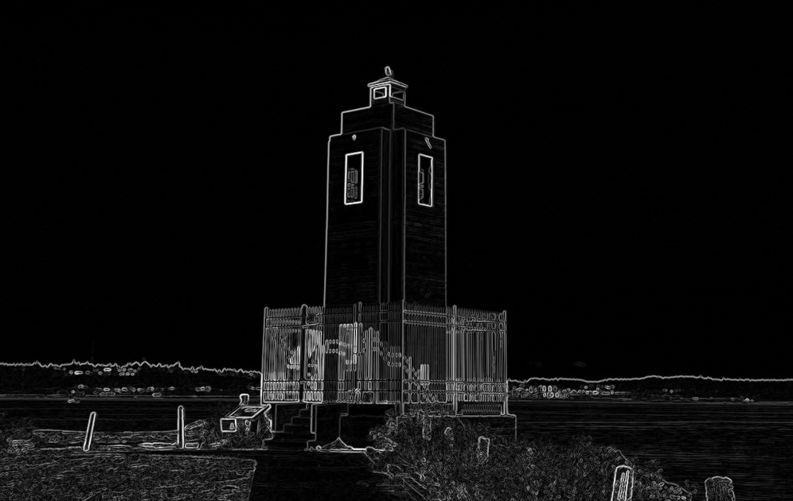

- **Gradient Phase**

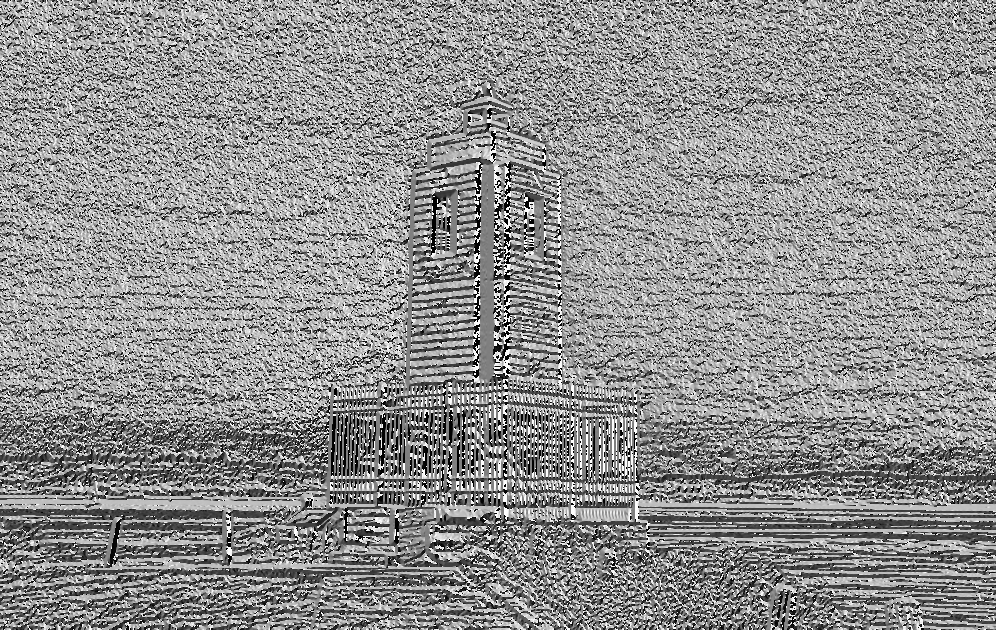


## 4. Second-Order Derivatives

Second-order derivatives are useful for detecting edges (when combined with thresholding and non-maximum suppression). However, they are more commonly used for feature detection, a topic that will be covered in Chapter 6.

### 4.1 Laplacian

The Laplacian operator calculates the divergence of the gradient of the image, effectively highlighting regions where there is a rapid change in intensity.

```cpp
void Laplacian(CImg<> &imageIn)
{
    CImg<> laplacian = imageIn.get_laplacian();
    laplacian.normalize(0, 255).save("./results/lighthouse_laplacian.png");
}
```

Mathematically, it is represented as:

\[ \nabla^2 f = \frac{{\partial^2 f}}{{\partial x^2}} + \frac{{\partial^2 f}}{{\partial y^2}} \]

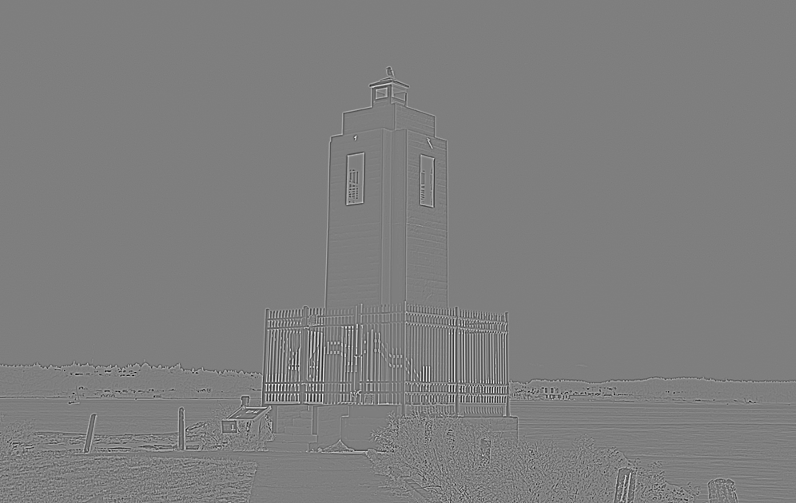

### 4.2 Hessian

The Hessian matrix consists of the second-order partial derivatives of the image.

```cpp
void Hessian(CImg<> &imageIn)
{
    CImg<> Ixx = imageIn.get_hessian("xx")[0];
    // ... rest of the code ...
}
```

It is mathematically expressed as:

\[ \mathbf{H} = \begin{bmatrix} \frac{{\partial^2 f}}{{\partial x^2}} & \frac{{\partial^2 f}}{{\partial x \partial y}} \\ \frac{{\partial^2 f}}{{\partial y \partial x}} & \frac{{\partial^2 f}}{{\partial y^2}} \end{bmatrix} \]

- **Hessian XX**
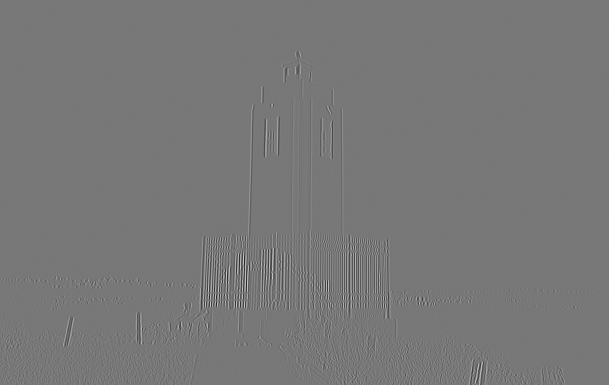

- **Hessian YY**
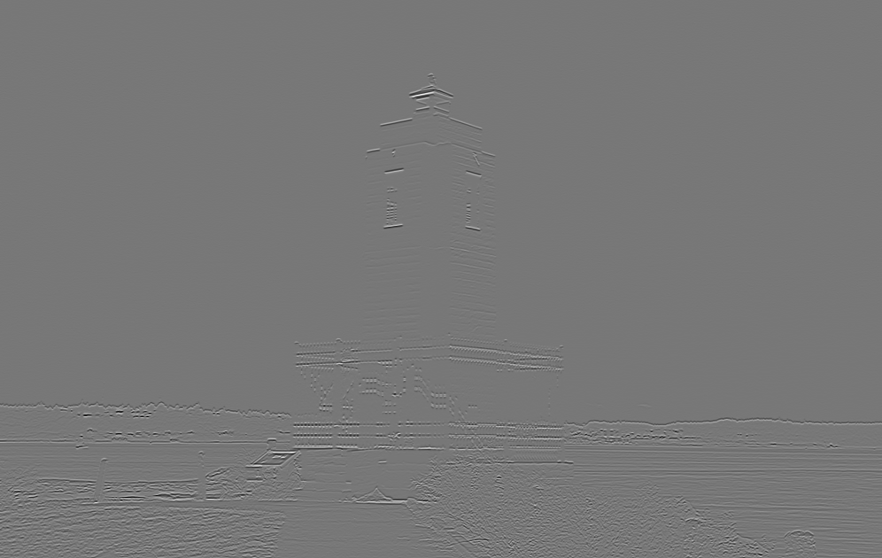

- **Hessian XY**
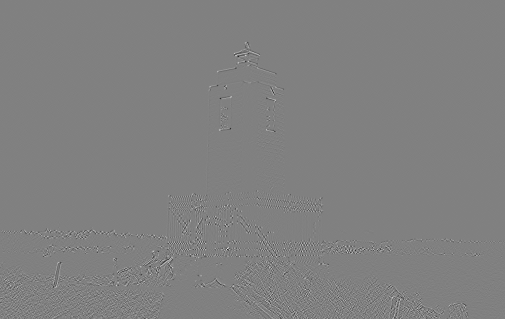

### 4.3 LoG (Laplacian of Gaussian)

LoG combines Gaussian smoothing with the Laplacian operator.

```cpp
void LoG(CImg<> &imageIn)
{
    CImg<> log = imageIn.get_blur(2).laplacian();
    // ... rest of the code ...
}
```

The expression for LoG is:

\[ \nabla^2 (G * f) = \nabla^2 G * f \]

where \( G \) is the Gaussian function.

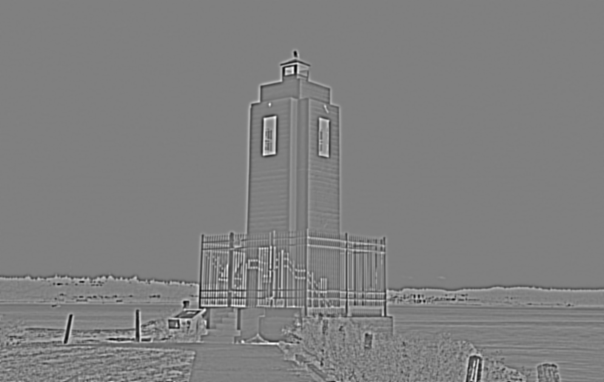

### 4.4 DoG (Difference of Gaussian)

DoG approximates the LoG by taking the difference between two blurred images with different standard deviations.

```cpp
void DoG(CImg<> &imageIn)
{
    CImg<> gauss1 = imageIn.get_blur(1);
    CImg<> gauss2 = imageIn.get_blur(2);
    CImg<> dog = gauss1 - gauss2;
    // ... rest of the code ...
}
```

Mathematically, DoG is represented as:

\[ \text{DoG} = (G_{\sigma_1} * f) - (G_{\sigma_2} * f) \]

where \( G_{\sigma_1} \) and \( G_{\sigma_2} \) are Gaussian functions with standard deviations \( \sigma_1 \) and \( \sigma_2 \), respectively.

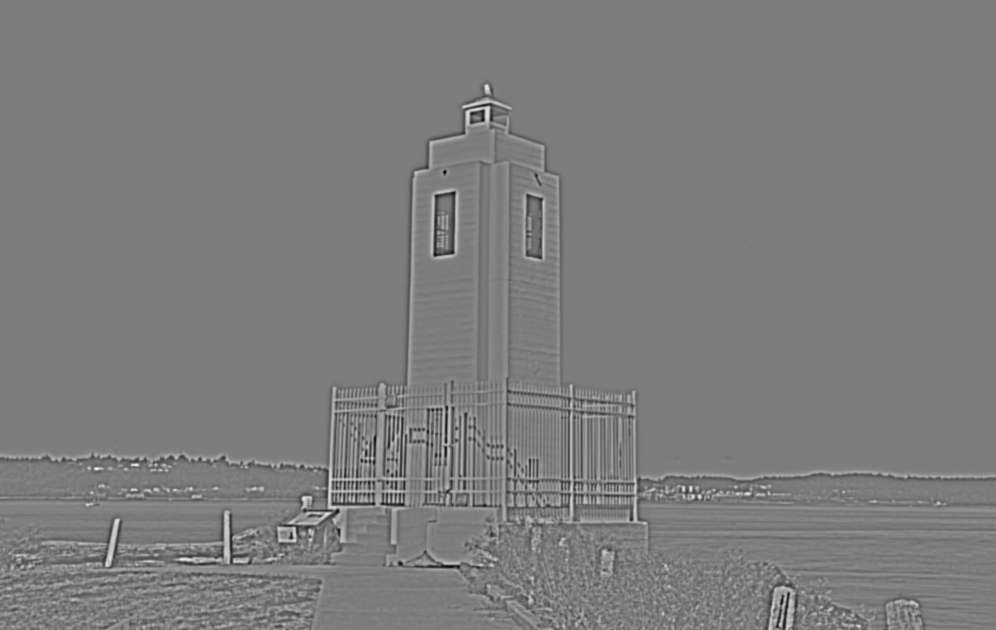

### Summary

| 2nd-Order Derivative    | Applications                  | Pros                                             | Cons                                |
|-------------------------|-------------------------------|--------------------------------------------------|-------------------------------------|
| **Laplacian**           | Edge Detection                | Sensitive to edges, Simple computation           | Noisy, Sensitive to noise           |
| **Hessian**             | Feature Detection             | Captures second-order information, Rich features | Computationally expensive           |
| **LoG (Laplacian of Gaussian)** | Edge Detection, Feature Detection | Reduces noise, Effective edge detection          | Slower than DoG                     |
| **DoG (Difference of Gaussian)** | Edge Detection, Approximation of LoG | Faster approximation of LoG                      | Less accurate than LoG              |

