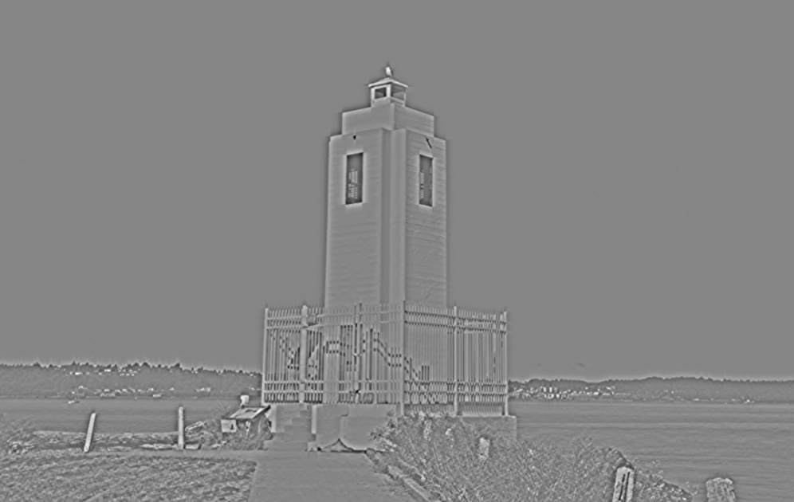

# Filtering - Learning Reflection

**Author**: Tony Fu  
**Date**: August 21, 2023  
**Device**: MacBook Pro 16-inch, Late 2021 (M1 Pro)  
**Code**: [GitHub](https://github.com/tonyfu97/Digital-Image-Processing/tree/main/05_filtering)  
**Reference**: Chapter 5 [*Digital Image Processing with C++: Implementing Reference Algorithms with the CImg Library* by Tschumperlé, Tilmant, Barra](https://www.amazon.com/Digital-Image-Processing-Implementing-Algorithms/dp/1032347538)

## 1. Convolution

```cpp
CImg<> sobel(3, 3, 1, 1, 0);
sobel(0, 0) = -1; sobel(0, 1) = -2; sobel(0, 2) = -1;
sobel(1, 0) = 0;  sobel(1, 1) = 0;  sobel(1, 2) = 0;
sobel(2, 0) = 1;  sobel(2, 1) = 2;  sobel(2, 2) = 1;
imgIn.convolve(sobel);
```

The above code snippet shows how to perform a convolution on an image with a 3x3 Sobel filter. The result is shown below:

- **Original**:


- **Convolution**:


### Boundary Conditions

Boundary conditions specify how to handle the edges and can be specified using the `const usigned int boundary_conditions` parameter of the `convolve()` method. The four boundary conditions provided by the CImg library have specific meanings:

1. **Dirichlet (0):** The pixels outside the image boundaries are considered to be zero. This creates a sort of "hard" edge around the image and can lead to noticeable artifacts along the borders.

2. **Neumann (1) (default):** The value of the border pixels is extended outside the image boundaries. Essentially, this reflects the gradient at the border, assuming that the intensity of the image doesn't change beyond the edge. This is the default boundary condition in CImg and tends to provide visually acceptable results.

3. **Periodic (2):** The image is treated as if it were tiling the plane in a repeated pattern. This means that the pixels on the right edge of the image are used as the boundary condition for the left edge, and the pixels on the bottom are used for the top. This can create seamless transitions but can also lead to strange effects if the image does not naturally tile.

4. **Mirror (3):** The pixels outside the image boundaries are determined by mirroring the pixels inside the boundaries. Imagine folding the image over at its edges, so the pixels just inside the border are duplicated just outside the border. This can create a more visually smooth transition at the edges but may not be appropriate for all types of images.


## 2. Median Fitler

```cpp
img.blur_median(3);
```

The above code snippet shows how to perform a median filter on an image with a 3x3 window. The result is shown below:

- **Origin**:


- **Median Filter**:


### Order-Statistic (OS) Filter

An [OS filter (Bovik, Huang, and Munson, 1983)](https://ieeexplore.ieee.org/document/1164247) is a non-linear filter that computes a linear combination of these sorted values:

\[ F = w_1 \cdot s_1 + w_2 \cdot s_2 + \ldots + w_n \cdot s_n \]

where \( w_i \) are the weights that define how much each ordered value contributes to the final result, and \( s_i \) are the sorted values of the neighborhood pixels.


## 3. First-Order Derivatives


The `get_gradient` function computes the image gradient along specified axes using different numerical schemes.

### Parameters

- **`axes`**: Axes considered for the gradient computation (e.g., "xy").
- **`scheme`**: Numerical scheme used for the gradient computation. Options are:

### Schemes

1. **Backward Finite Differences (`scheme = -1`)**
   Computes the gradient using backward finite differences:

    \[
    \text{grad}[pos] = \text{data}[pos] - \text{data}[pos - \text{off}]
    \]

2. **Central Finite Differences (`scheme = 0`)**
   Computes the gradient using central finite differences:

    \[
    \text{grad}[pos] = \frac{\text{data}[pos + \text{off}] - \text{data}[pos - \text{off}]}{2}
    \]

3. **Forward Finite Differences (`scheme = 1`)**
   Computes the gradient using forward finite differences:

    \[
    \text{grad}[pos] = \text{data}[pos + \text{off}] - \text{data}[pos]
    \]

4. **Sobel Scheme (`scheme = 2`)**
   Utilizes Sobel operators to compute the gradient.

5. **Rotation Invariant Scheme (`scheme = 3`)**
   Uses a rotation-invariant kernels:

    \[
    \text{Rotation-Invariant}_{x} = \begin{bmatrix} -a & -b & -a \\ 0 & 0 & 0 \\ a & b & a \end{bmatrix}\\
    \text{Rotation-Invariant}_{y} = \text{Rotation-Invariant}_{x}^T
    \]

    where \( a = 0.25 \times (2 - \sqrt{2}) \) and \( b = 0.5 \times (\sqrt{2} - 1) \). 

6. **Deriche Recursive Filter**: Introduced later.
7. **Van Vliet Recursive Filter**: Introduced later.

| Scheme                       | Applications                  | Pros                                     | Cons                                |
|------------------------------|-------------------------------|------------------------------------------|-------------------------------------|
| Backward finite differences  | General-purpose               | Simple, easy to implement                | Less accurate, sensitive to noise   |
| Centered finite differences  | General-purpose               | More accurate than forward/backward      | Sensitive to noise                  |
| Forward finite differences   | General-purpose               | Simple, easy to implement                | Less accurate, sensitive to noise   |
| Using Sobel kernels          | Edge detection                | Good at capturing edges, less noisy      | Can miss fine details               |
| Using rotation invariant     | Edge detection, texture analysis| Rotation invariant, captures subtle edges| More computationally expensive      |
| Using Deriche recursive filter| Smoothing, edge detection     | Smooths noise, good edge detection       | Computationally expensive           |
| Using Van Vliet recursive filter| Smoothing, edge detection    | Smooths noise, efficient computation     | Might blur some edges               |

### Example

```cpp
// Gradient approximation using centered finite differences.
CImgList<> grad = imageIn.get_gradient();

// Norm and phase of the gradient.
CImg<>
    norm = (grad[0].get_sqr() + grad[1].get_sqr()).sqrt(),
    phi = grad[1].get_atan2(grad[0]);
```

- **Original**


- **Gradient X**


- **Gradient Y**


- **Gradient Norm**


- **Gradient Phase**


## 4. Second-Order Derivatives

Second-order derivatives are useful for detecting edges (when combined with thresholding and non-maximum suppression). However, they are more commonly used for feature detection, a topic that will be covered in Chapter 6.

### 4.1 Laplacian

The Laplacian operator calculates the divergence of the gradient of the image, effectively highlighting regions where there is a rapid change in intensity.

```cpp
void Laplacian(CImg<> &imageIn)
{
    CImg<> laplacian = imageIn.get_laplacian();
    laplacian.normalize(0, 255).save("./results/lighthouse_laplacian.png");
}
```

Mathematically, it is represented as:

\[ \nabla^2 f = \frac{{\partial^2 f}}{{\partial x^2}} + \frac{{\partial^2 f}}{{\partial y^2}} \]


### 4.2 Hessian

The Hessian matrix consists of the second-order partial derivatives of the image.

```cpp
void Hessian(CImg<> &imageIn)
{
    CImg<> Ixx = imageIn.get_hessian("xx")[0];
    // ... rest of the code ...
}
```

It is mathematically expressed as:

\[ \mathbf{H} = \begin{bmatrix} \frac{{\partial^2 f}}{{\partial x^2}} & \frac{{\partial^2 f}}{{\partial x \partial y}} \\ \frac{{\partial^2 f}}{{\partial y \partial x}} & \frac{{\partial^2 f}}{{\partial y^2}} \end{bmatrix} \]

- **Hessian XX**


- **Hessian YY**


- **Hessian XY**


### 4.3 LoG (Laplacian of Gaussian)

LoG combines Gaussian smoothing with the Laplacian operator.

```cpp
void LoG(CImg<> &imageIn)
{
    CImg<> log = imageIn.get_blur(2).laplacian();
    // ... rest of the code ...
}
```

The expression for LoG is:

\[ \nabla^2 (G * f) = \nabla^2 G * f \]

where \( G \) is the Gaussian function.


### 4.4 DoG (Difference of Gaussian)

DoG approximates the LoG by taking the difference between two blurred images with different standard deviations.

```cpp
void DoG(CImg<> &imageIn)
{
    CImg<> gauss1 = imageIn.get_blur(1);
    CImg<> gauss2 = imageIn.get_blur(2);
    CImg<> dog = gauss1 - gauss2;
    // ... rest of the code ...
}
```

Mathematically, DoG is represented as:

\[ \text{DoG} = (G_{\sigma_1} * f) - (G_{\sigma_2} * f) \]

where \( G_{\sigma_1} \) and \( G_{\sigma_2} \) are Gaussian functions with standard deviations \( \sigma_1 \) and \( \sigma_2 \), respectively.


### Summary

| 2nd-Order Derivative    | Applications                  | Pros                                             | Cons                                |
|-------------------------|-------------------------------|--------------------------------------------------|-------------------------------------|
| **Laplacian**           | Edge Detection                | Sensitive to edges, Simple computation           | Noisy, Sensitive to noise           |
| **Hessian**             | Feature Detection             | Captures second-order information, Rich features | Computationally expensive           |
| **LoG (Laplacian of Gaussian)** | Edge Detection, Feature Detection | Reduces noise, Effective edge detection          | Slower than DoG                     |
| **DoG (Difference of Gaussian)** | Edge Detection, Approximation of LoG | Faster approximation of LoG                      | Less accurate than LoG              |


## 5. Adaptive Filtering (Sigma Filter)

Traditional smoothing filters often blur the edges along with reducing noise, causing a loss of important details. On the other hand, adaptive or other nonlinear filters like the sigma filter promise to reduce noise in images while preserving edges and contours. The method is based on the principle of weighting the influence of neighboring pixels based on the gradient, similar to some normalization or shunting mechanisms found in neuroscience.

### 1. Gradient Calculation

First, the code calculates the gradient of the input image using the `get_gradient()` method:

```cpp
CImgList<> g = imgIn.get_gradient();
CImg<> grad = (g[0].get_sqr() + g[1].get_sqr()).sqrt();
```

The gradient, \(\nabla f\), quantifies the rate of change in pixel values across the image and is given by the formula:

\[
\nabla f = \sqrt{{\left(\frac{{\partial f}}{{\partial x}}\right)}^2 + {\left(\frac{{\partial f}}{{\partial y}}\right)}^2}
\]

### 2. Sum of Gradients

Next, the sum of gradients in a 3x3 neighborhood is computed:

```cpp
CImg<> Sgrad = grad.get_convolve(CImg<>(3, 3, 1, 1, 1));
```

This step convolves the gradient with a 3x3 filter, summing the neighboring gradients, effectively measuring local variations in pixel intensities.

### 3. Adaptive Weighting

The code then applies adaptive weighting using the following lines:

```cpp
float epsilon = 100;
CImg<> rap = imgIn.get_div(grad + epsilon);
```

Here, the division acts as a weighting coefficient, with the epsilon term preventing division by zero. The weight of a pixel in the sum is inversely proportional to the local gradient:

\[
\text{{weight}} = \frac{{f}}{{\nabla f + \epsilon}}
\]

In `rap`, the pixels with high gradients are weighted less, but in this case, less actually means darker pixels! So, this code is emphasizing the edges and contours of the image.

We started with this image:


And ended up with this:


### 4. Smoothing Operation

The smoothing operation is performed in the following lines:

```cpp
CImg_3x3(I, float); // declare Ipp, Ipc, etc.
cimg_for3x3(rap, x, y, 0, 0, I, float)
    imgOut(x, y) = (Ipp + Ipc + Ipn + Icp + Icc + Icn + Inp + Inc + Inn) / (Sgrad(x, y) + epsilon);
```

Here, `CImg_3x3(I, float);` declares variables like `Ipp`, `Ipc`, etc., representing the neighboring pixels. The `cimg_for3x3` macro iterates through the image, applying the smoothing operation. The numerator is a simple average (actually sum) filter, and the bottom term is larger for pixels with high gradients. Therefore, we emphasize the edges and contours again by making those pixels darker.

The final formula for smoothing is:

\[
\text{{imgOut}}(x, y) = \frac{{\sum \text{{neighboring pixels}}}}{{\text{{Sgrad}}(x, y) + \epsilon}}
\]


As you can see, the noise are amplified along with the edges are emphasized. This adaptive sigma filter may not be the best choice for this image.

The somewhat cartoon-like appearance of the final output image is a common effect of adaptive smoothing techniques like the sigma filter. By emphasizing edges and smoothing uniform areas, the image can take on a more stylized or abstract appearance. 

### Connection to Neuroscience

The adaptive nature of this method is akin to the way some neurons modulate their response based on local activity. It aligns with principles observed in neuroscience where the influence of neighboring neurons is normalized or shunted based on the local context, allowing for a balance between sensitivity to stimuli and adaptation to the local environment.


## 6. Adaptive Window Filters

Adaptive window filters are smart filters that change their behavior based on the characteristics of the area they are working on. They look at each pixel and decide the best way to smooth or sharpen it based on the pixels around it. There are different ways to do this, and here are three examples using the following noisy image (Gaussian noise \( \sigma = 40 \)):


### 6.1 Nagao Filter
Imagine you have a small grid (usually 5x5) around a pixel in the middle. In this grid, you create 9 different windows (smaller groups of pixels), each containing 9 pixels. Here we first intialize the windows:

```cpp
CImgList<unsigned char> Nagao(9, 5, 5, 1, 1, 0);
Nagao(0, 0, 0) = Nagao(0, 0, 1) = Nagao(0, 0, 2) = Nagao(0, 0, 3) =
    Nagao(0, 0, 4) = Nagao(0, 1, 1) = Nagao(0, 1, 2) = Nagao(0, 1, 3) =
        Nagao(0, 2, 2) = 1;
for (int i = 1; i < 4; ++i)
    Nagao[i] = Nagao[0].get_rotate(i * 90);

Nagao(4, 1, 1) = Nagao(4, 1, 2) = Nagao(4, 1, 3) = Nagao(4, 2, 1) =
    Nagao(4, 2, 2) = Nagao(4, 2, 3) = Nagao(4, 3, 1) = Nagao(4, 3, 2) =
        Nagao(4, 3, 3) = 1;

Nagao(5, 0, 0) = Nagao(5, 0, 1) = Nagao(5, 0, 2) = Nagao(5, 1, 0) =
    Nagao(5, 1, 1) = Nagao(5, 1, 2) = Nagao(5, 2, 0) = Nagao(5, 2, 1) =
        Nagao(5, 2, 2) = 1;
for (int i = 1; i < 4; ++i)
    Nagao[5 + i] = Nagao[5].get_rotate(i * 90);
```


For each window:

- You calculate the average color (mean) and how much the colors vary (variance).
- You pick the window where the colors vary the least (smallest variance).
- You replace the middle pixel with the average color from that chosen window.

Here is the code:

```cpp
CImg<>
    mu(9, 1, 1, 1, 0),
    sigma(9, 1, 1, 1, 0),
    st,
    N(5, 5);
CImg<int> permutations;
cimg_for5x5(imgIn, x, y, 0, 0, N, float)
{
    CImgList<> res(9);
    for (int i = 0; i < 9; ++i)
    {
        res[i] = N.get_mul(Nagao[i]);
        st = res[i].get_stats();
        mu[i] = st[2];
        sigma[i] = st[3];
    }
    // Searching minimal variance.
    sigma.sort(permutations);
    imgOut(x, y) = mu[permutations[0]];
}
```


This method helps to keep the details in the image while reducing noise.

### 6.2 Kuwahara Filter
The Kuwahara filter is like the Nagao filter, but only uses windows 5 - 8 of Nagao filter. It's just a variation that might work better on certain types of images. The basic idea of finding the least varying window and using its average color remains the same.


## 7. Deriche Recursive Filters

John Canny's work on edge detection is not only confined to the Canny edge detector but also includes mathematical foundations for defining the criteria of an effective edge detector. Canny outlined three criteria: good detection, good localization, and a single response. The first two criteria can be combined to yield a so-called *Canny criterion value*, adding mathematical rigor to the field of edge detection.

The [Deriche recursive filter](https://en.wikipedia.org/wiki/Deriche_edge_detector) is an recursive solution to Canny's criteria. However, in the book, Deriche filter is presented as a family of recursive (and potentially more efficient) alternatives to smoothing operation (0-th order), gradient computation (1st order), and Laplacian computation (2nd order).

The function `CImg<T>& deriche(const float sigma, const unsigned int order=0, const char axis='x')` filter applies in one direction at once. `sigma` is the standard deviation of the filter, while `order` is the order of the derivative to compute. `axis` is the axis along which the filter is applied.

### 7.1 Smoothing (0-th Order)

```cpp
CImg<> img_deriche0 = imgIn.get_deriche(SIGMA, 0, 'x');
img_deriche0.deriche(SIGMA, 0, 'y');
```


### 7.2 Gradient Computation (1st Order)

```cpp
CImg<> img_deriche1 = imgIn.get_deriche(SIGMA, 1, 'x');
img_deriche1.deriche(SIGMA, 1, 'y');
CImg<> img_deriche1_norm = (img_deriche1.get_sqr() += img_deriche1.get_sqr()).sqrt();
```


### 7.3 Laplacian Computation (2nd Order)

```cpp
CImg<> img_deriche2_x = imgIn.get_deriche(SIGMA, 2, 'x');
CImg<> img_deriche2_y = imgIn.get_deriche(SIGMA, 2, 'y');
CImg<> img_deriche2_laplacian = img_deriche2_x + img_deriche2_y;
```




## 8. Frequency Domain Filtering

### 8.1 Using `CImg<>::FFT()`

#### Load the image and convert to grayscale

```cpp
CImg<unsigned char> img("../images/lighthouse.png");
CImg<> lum = img.get_norm().blur(0.75f);
```

#### Resize the image

FFT requires dimensions to be a power of 2, so resize the image to meet this requirement.

```cpp
int width = 1 << static_cast<int>(std::ceil(std::log2(lum.width())));
int height = 1 << static_cast<int>(std::ceil(std::log2(lum.height())));
lum.resize(width, height, -100, -100, 0);
```

#### Compute the FFT

```cpp
CImgList<> fft = lum.get_FFT();
```

#### Process Magnitude

Take the logarithm of the magnitude part to better visualize it, and then shift the zero frequency component to the center of the spectrum.

```cpp
CImg<> magnitude(fft[0]);
magnitude += 1; // Avoid log(0)
magnitude.log();
magnitude.shift(magnitude.width() / 2, magnitude.height() / 2, 0, 0, 2);
```

#### (Optional) Compute Inverse FFT

Perform the inverse FFT to recover the original image.

```cpp
CImg<> img_ifft = fft.get_FFT(true)[0];
```

### 8.2 Butterworth Filters

The idea of frequency-domain filtering involves first transforming the image into the frequency domain, then multiplying the image with a mask, and finally transforming the image back to the spatial domain. Theoretically, this is equivalent to convolving the image with the mask in the spatial domain. It might sound like a lot of extra work, but the Fast Fourier Transform (FFT) makes it much faster. However, you need to be mindful of artifacts such as the Gibbs phenomenon, which can be reduced by using appropriate windowing functions.

Butterworth filters are a family of filters characterized by a maximally flat frequency response. They can be applied in both analog and digital forms, and in both time and frequency domains.

In the analog frequency domain, the 2D transfer function for a Butterworth low-pass filter can be represented as:
\[ H(u,v) = \frac{1}{1 + \left( \frac{D(u,v)}{D_0} \right)^{2n}} \]
where \( D(u,v) = \sqrt{u^2 + v^2} \) is the distance from the origin in the frequency domain, and \( D_0 \) is the cutoff frequency. The parameter \( n \) is the order of the filter. Increasing \( n \) will result in a steeper roll-off, but at the expense of increased complexity, potential instability, and possible phase distortion.

In the spatial domain, you would have to use the inverse Fourier transform to obtain a corresponding difference equation.

### 8.3 Gaussian Filters

The Gaussian filter can be implemented in both time and frequency domains Here's how to apply a Gaussian filter in the frequency domain:

#### Perform the Fast Fourier Transform (FFT)
First, compute the FFT of the input image.

```cpp
CImgList<> fImg = imgIn.get_FFT();
```

#### Create the Gaussian Mask
Construct the frequency response of the filter using the Gaussian function. The Gaussian mask is defined in the frequency domain, and `sigma` is the standard deviation controlling the spread of the Gaussian function. In the frequency domain, the filter is described by the Gaussian function:

\[ H(u, v) = 2\pi \sigma^2 \exp\left(-2\pi^2\sigma^2\left(\left(\frac{u}{W} - 0.5\right)^2 + \left(\frac{v}{H} - 0.5\right)^2\right)\right) \]

Here, \( W \) and \( H \) are the width and height of the image, \( \sigma^2 \) is the squared standard deviation, and \( (u,v) \) are the frequency coordinates.

```cpp
CImg<> gaussMask(imgIn.width(), imgIn.height());
float sigma2 = cimg::sqr(sigma);
cimg_forXY(gaussMask, x, y)
{
    float fx = x / (float)imgIn.width() - 0.5f, fx2 = cimg::sqr(fx),
          fy = y / (float)imgIn.height() - 0.5f,
          fy2 = cimg::sqr(fy);
    gaussMask(x, y) = 2 * cimg::PI * sigma2 *
                      std::exp(-2 * cimg::sqr(cimg::PI) * sigma2 * (fx2 + fy2));
}
```

#### Zero Shift the Gaussian Mask
Shift the Gaussian mask by half its width and height to center the zero frequency.

```cpp
// Zero shift.
gaussMask.shift(-imgIn.width() / 2, -imgIn.height() / 2, 0, 0, 2);
```

#### Apply the Filter
Perform the element-wise multiplication of the Fourier Transformed image and the Gaussian mask.

```cpp
// Filtering
cimglist_for(fImg, k)
    fImg[k].mul(gaussMask);
```

#### Inverse FFT and Normalize
Transform back to the spatial domain via inverse FFT and normalize the result.

```cpp
// Inverse FFT and real part.
return fImg.get_FFT(true)[0].normalize(0, 255);
```


## 9. Diffusion Filtering
