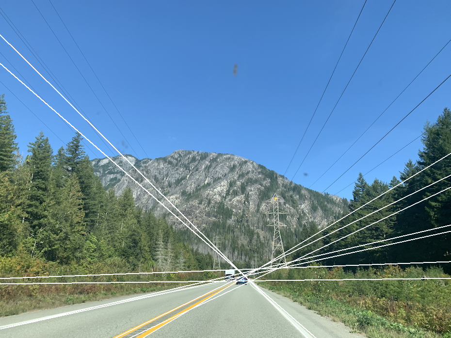

# Feature Extraction - Learning Reflection

**Author**: Tony Fu  
**Date**: August 23, 2023  
**Device**: MacBook Pro 16-inch, Late 2021 (M1 Pro)  
**Code**: [GitHub](https://github.com/tonyfu97/Digital-Image-Processing/tree/main/06_feature_extraction)  
**Reference**: Chapter 6 [*Digital Image Processing with C++: Implementing Reference Algorithms with the CImg Library* by Tschumperlé, Tilmant, Barra](https://www.amazon.com/Digital-Image-Processing-Implementing-Algorithms/dp/1032347538)

## 1. Harris-Stephens Corner Detector

I love the explanation of the Corner detection by Professor Shree K. Nayar ([Video link](https://youtu.be/Z_HwkG90Yvw)). Here is the summary:

The Harris-Stephens corner detection algorithm is designed to identify regions where there are substantial variations in gradient in two distinct directions. While it might be simple to detect corners aligned with the x and y axes, real-world images present corners at various angles. This challenge is addressed by using the determinant, which gives a measure of how well-separated the two gradient directions are. A larger determinant typically signifies a strong presence of two different gradient directions. However, an excessively large axis in one direction could mislead the interpretation. To counterbalance this, the algorithm subtracts a term related to the trace, squared and weighted by a parameter, from the determinant. This penalizes the response value \(R\) and aids in distinguishing between genuine corners and edges or flat regions, leading to more accurate corner detection. Here are the steps:

### 1.1 Gradient Calculation

The gradient of the input image is calculated using:
\[ \text{{gradXY}} = \text{{imgIn.get_gradient()}}; \]
This gets the gradients in the x and y directions.

### 1.2 Structure Tensor

```cpp
CImg<>
    Ixx = gradXY[0].get_mul(gradXY[0]).get_convolve(G),
    Iyy = gradXY[1].get_mul(gradXY[1]).get_convolve(G),
    Ixy = gradXY[0].get_mul(gradXY[1]).get_convolve(G);
```

The structure tensor is computed as:
\[
\begin{align*}
I_{xx} &= \text{{gradXY[0].get_mul(gradXY[0]).get_convolve(G)}}, \\
I_{yy} &= \text{{gradXY[1].get_mul(gradXY[1]).get_convolve(G)}}, \\
I_{xy} &= \text{{gradXY[0].get_mul(gradXY[1]).get_convolve(G)}}.
\end{align*}
\]
 
where the Gaussian kernel \(G\) is defined as:
\[ G(x, y) = \frac{1}{2\pi\sigma^2} e^{-\frac{x^2 + y^2}{2\sigma^2}} \]

Together, we can build the structure tensor \(M\) as:

$$
M = \begin{bmatrix} I_{xx} & I_{xy} \\ I_{xy} & I_{yy} \end{bmatrix}
$$

The determinant of \(M\) (\(\det(M)\)) and the trace of \(M\) (\(\text{trace}(M)\)) are computed as follows:

$$\det(M) = I_{xx} \cdot I_{yy} - I_{xy} \cdot I_{xy}$$

$$\text{trace}(M) = I_{xx} + I_{yy}$$

The structure tensor \(M\) plays a key role in feature detection as it represents the distribution of gradients within a specific neighborhood around a point. Rather than directly comparing the gradient of a pixel with those of its neighbors, we use a Gaussian function to calculate an average gradient across an area.

In essence, the structure tensor captures the underlying geometric structure in the vicinity of each pixel. It accomplishes this by portraying gradient orientations as an ellipse in the (\(I_x, I_y\)) plane within a specific window. Here, the determinant is directly proportional to the area of the ellipse, while the trace is equivalent to the sum of the lengths of the ellipse's major and minor axes.

- **Presence of an edge**: When an image contains an edge, the distribution of gradients forms a slender, elongated ellipse. This happens because the intensity changes consistently in one direction (along the edge) and shows little to no change in the direction perpendicular to it. The major axis of this ellipse aligns with the direction of the edge.

- **Presence of a corner**: If a corner is present, the gradients are distributed more evenly, resulting in an elliptical shape that resembles a circle. This is because a corner features significant intensity changes in multiple directions.

- **Flat region**: In a flat region of the image, where there is minimal change in intensity in any direction, the ellipse is small, signaling the absence of distinctive features.

### 1.3 R Function Calculation

```cpp
CImg<>
    det = Ixx.get_mul(Iyy) - Ixy.get_sqr(),
    trace = Ixx + Iyy,
    R = det - k * trace.get_sqr();
```

Often, in the theoretical explanation of the Harris-Stephens corner detection algorithm, we will see the eigenvalues \(\lambda_1\) and \(\lambda_2\) are often introduced to provide an intuitive understanding of the underlying geometric properties of the image. However, in the actual implementation, you can compute the response function \(R\) directly from the components of the second-moment matrix \(I_{xx}\), \(I_{yy}\), and \(I_{xy}\), without having to explicitly calculate the eigenvalues. It is given as:
\[ R = \det - \, k \cdot \text{{trace}}^2 = (I_{xx} \cdot I_{yy} - I_{xy}^2) - k \cdot (I_{xx} + I_{yy})^2\]

| Condition          | Region Type | Explanation                                                                                                                                                 |
|--------------------|-------------|-------------------------------------------------------------------------------------------------------------------------------------------------------------|
| R is close to 0    | Flat Region | No significant change in intensity in any direction, both eigenvalues of the structure tensor are small.                                                     |
| R is small      | Edge        | Significant change in intensity in one direction but not the other, one large and one small eigenvalue of the structure tensor.                               |
| R is positive      | Corner      | Significant changes in intensity in both directions, both eigenvalues of the structure tensor are large, indicating two dominant and different edge directions. |

### 1.4 Local Maxima Detection

```cpp
CImgList<> imgGradR = R.get_gradient();
CImg_3x3(I, float);
CImg<> harrisValues(imgIn.width() * imgIn.height(), 1, 1, 1, 0);
CImg<int>
    harrisXY(imgIn.width() * imgIn.height(), 2, 1, 1, 0),
    perm(imgIn.width() * imgIn.height(), 1, 1, 1, 0);
int nbHarris = 0;
cimg_for3x3(R, x, y, 0, 0, I, float)
{
    if (imgGradR[0](x, y) < eps && imgGradR[1](x, y) < eps)
    {
        float
            befx = Ipc - Icc,
            befy = Icp - Icc,
            afty = Icn - Icc,
            aftx = Inc - Icc;
        if (befx < 0 && befy < 0 && aftx < 0 && afty < 0)
        {
            harrisValues(nbHarris) = R(x, y);
            harrisXY(nbHarris, 0) = x;
            harrisXY(nbHarris++, 1) = y;
        }
    }
}
```

Local maxima of the \(R\) function are detected. This part of the code finds points that are potential corners.

### 1.5 Sorting the Corners

```cpp
harrisValues.sort(perm, false);
```

The values are sorted, and the top \( n \) corners are drawn on the image. In other implementations, this step is usually replaced by non-maximum suppression.


## 2. Shi-Tomasi Algorithm

Shi-Tomasi algorithm uses similar techniques to compute eigenvalues that represent the local structure of the image, but it applies a different criteria to determine if a region is a corner:

$$
R = \min(\lambda_1, \lambda_2)
$$

The algorithm is implemented as follows:

```cpp
CImg<>
    det = Ixx.get_mul(Iyy) - Ixy.get_sqr(),
    trace = Ixx + Iyy,
    diff = (trace.get_sqr() - 4 * det).sqrt(),
    lambda1 = (trace + diff) / 2,
    lambda2 = (trace - diff) / 2,
    R = lambda1.min(lambda2);
```


Shi-Tomasi's reliance on the minimum eigenvalue often leads to better detection of true corners. Not sure about this one.


## 3. Hough Transform

Again, I recommend watching Professor Shree K. Nayar's [video](https://youtu.be/XRBc_xkZREg?si=WBN-WPRsqEndBMcA) on the Hough Transform. Here's a summary:

The Hough Transform is a technique used to detect shapes that can be represented by a mathematical equation. It's particularly useful for finding lines and circles. Essentially, it involves a "transformation" from the image space to the parameter space.

For detecting lines, you might represent them with the equation \(y = mx + b\), where the parameter space consists of the slope \(m\) and the intercept \(b\). However, this representation can be problematic since the slope \(m\) can become infinite. A better approach uses the polar form \(r = x \cos \theta + y \sin \theta\), where \(r\) is the distance from the origin to the line, and \(\theta\) is the angle between the line and the x-axis. In this case, the parameter space is defined by \(r\) and \(\theta\).

This parameter space is divided into a grid, where each cell represents a potential line in the image space. The algorithm then iterates through each pixel in the image space, incrementing the corresponding cell in the parameter space. The cell with the highest count (or "votes," as Professor Nayar puts it) represents the detected line.


| Shape in Image Space | Representation in Parameter Space | Parameters  | Equation (if applicable)                               |
|----------------------|---------------------------------------------------|-----------------------------------------|---------------------------------------------------------|
| Line                 | Point                                             | Slope (m), Intercept (b)                | \( y = mx + b \)                                         |
| Line (Polar Form)    | Sinusoidal Curve                                  | Distance (r), Angle (θ)                 | \( r = x \cos \theta + y \sin \theta \)                   |
| Circle               | 3D Surface                                         | Center (a, b), Radius (r)               | \( (x - a)^2 + (y - b)^2 = r^2 \)                         |
| Ellipse              | 4D Surface                                         | Center (a, b), Major/Minor Axes (r1, r2) | \( \frac{{(x - a)^2}}{{r1^2}} + \frac{{(y - b)^2}}{{r2^2}} = 1 \) |


### 3.1 Initializing Variables
The code starts by defining variables for the accumulator, image dimensions, and bounds of the parameters.

```cpp
CImg<>
    acc(500, 400, 1, 1, 0),
    imgOut(imgIn);
int
    wx = imgIn.width(),
    wy = imgIn.height();

float
    rhomax = std::sqrt((float)(wx * wx + wy * wy)) / 2,
    thetamax = 2 * cimg::PI;
```

### 3.2 Gradient Calculation and Smoothing
The code calculates the gradient of the input image and applies a blur to smooth it.

```cpp
CImgList<> grad = imgIn.get_gradient();
cimglist_for(grad, l)
    grad[l].blur(1.5f);
```

### 3.3 Hough Space Calculation

The Hough space is a mathematical representation that helps in identifying lines in an image. In the Hough space, a line can be represented by two parameters: \(\rho\) and \(\theta\), where \(\rho\) (same as \( r\) mentioned above) is the distance from the origin to the closest point on the straight line, and \(\theta\) is the angle formed by this perpendicular line and the horizontal axis.

#### 3.3.1 Calculating the Gradient and the Angles

The code snippet begins by iterating over all the pixels in the input image to calculate the gradient at each pixel:

```cpp
float
    X = (float)x - wx / 2,
    Y = (float)y - wy / 2,
    gx = grad(0, x, y),
    gy = grad(1, x, y),
    theta = std::atan2(gy, gx);
```

Here, \(X\) and \(Y\) represent the coordinates if the origin is at the center of the image. The gradient at each pixel is given by \((gx, gy)\), and \(\theta\) is calculated using the arctangent function, which gives the angle of the gradient vector.

#### 3.3.2 Calculating \(\rho\)

Next, the code calculates \(\rho\) as follows:

```cpp
rho = std::sqrt(X * X + Y * Y) * std::cos(std::atan2(Y, X) - theta);
```

The value of \(\rho\) is computed using the distance formula and the cosine of the difference between the angle of the vector to the origin \((X, Y)\) and \(\theta\).

#### 3.3.3 Adjusting \(\rho\) and \(\theta\)

If \(\rho\) is negative, it's multiplied by -1, and \(\theta\) is adjusted by adding \(\pi\):

```cpp
if (rho < 0)
{
    rho *= -1;
    theta += cimg::PI;
}
theta = cimg::mod(theta, thetamax);
```

This ensures that \(\rho\) is positive, and \(\theta\) is within the valid range.

#### 3.3.4 Populating the Accumulator

Finally, the accumulator is updated based on the calculated \(\rho\) and \(\theta\):

```cpp
acc((int)(theta * acc.width() / thetamax), (int)(rho * acc.height() / rhomax)) += (float)std::sqrt(gx * gx + gy * gy);
```


The accumulator's cell corresponding to \(\rho\) and \(\theta\) is incremented by the magnitude of the gradient. This process effectively votes for the parameters of the line that the current pixel might be part of. By the end of this process, the accumulator will contain information about the lines present in the image, represented in the Hough space.

### 3.4 Accumulator Smoothing and Thresholding
The accumulator is smoothed and thresholded to identify significant lines.

```cpp
// Smoothing the accumulators.
acc.blur(0.5f);
CImg<> acc2(acc);

// Log transform to enhance the contrast of small values.
cimg_forXY(acc2, x, y)
    acc2(x, y) = (float)std::log(1 + acc(x, y));

// Thresholding and filtering the accumulators.
int size_max = acc2.get_threshold(thr * acc2.max()).get_label().max();
CImg<int> coordinates(size_max, 2, 1, 1, 0);
int accNumber = 0;
AccThreshold(acc2, thr * acc2.max(), 4, coordinates, accNumber);
```

The `AccThreshold()` function is also defined in `hough.cpp`. It modifies `coordinates` and `accNumber` in place. `coordinates` contains the coordinates of the local maxima in the accumulator grid that are above the given threshold, and `accNumber` contains the count of such maxima. The image below shows the accumulator after smoothing and thresholding with a threshold value of 0.9.


### 3.5 Line Display
Finally, the detected lines are drawn on the output image using the calculated rho and theta values.

```cpp
unsigned char col1[3] = {255, 255, 0};
for (unsigned i = 0; i < accNumber; ++i)
{
    // Drawing lines
    // ...
    imgOut.draw_line(x0, y0, x1, y1, col1, 1.0f).draw_line(x0 + 1, y0, x1 + 1, y1, col1, 1.0f).draw_line(x0, y0 + 1, x1, y1 + 1, col1, 1.0f);
}
return imgOut;
```

* **Threshold = 0.5**


* **Threshold = 0.6**


* **Threshold = 0.7**


* **Threshold = 0.8**



* **Threshold = 0.9**


Certainly! Here's the documentation:

### Circle Detection

The Hough Transform can also be used to detect circles. In this case, the parameter space is 3D, with the parameters being the center of the circle \((xc, yc)\) and the radius \(r\). The equation of a circle is given by:
\[ (x - xc)^2 + (y - yc)^2 = r^2 \]

See `hough_circle.cpp` for the implementation.

Starting with a binarized image of coins:


The Hough Transform is applied to detect the circles:


The middle coin at the bottom was not detected perhaps because the binarization process caused it to be broken.


