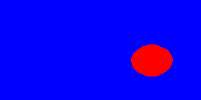
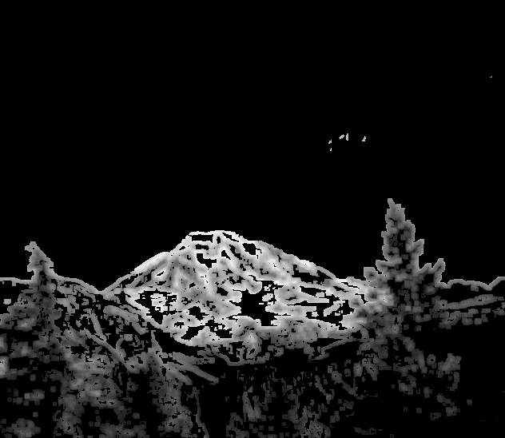

# Segmentation - Learning Reflection

**Author**: Tony Fu  
**Date**: August 25, 2023  
**Device**: MacBook Pro 16-inch, Late 2021 (M1 Pro)  
**Code**: [GitHub](https://github.com/tonyfu97/Digital-Image-Processing/07_segmentation)  
**Reference**: Chapter 7 [*Digital Image Processing with C++: Implementing Reference Algorithms with the CImg Library* by Tschumperlé, Tilmant, Barra](https://www.amazon.com/Digital-Image-Processing-Implementing-Algorithms/dp/1032347538)

## 1. Active Contours

This chapter is quite math-heavy, so for a more intuitive understanding of the concepts, I recommend checking out Professor Shree Nayar's [lecture](https://youtu.be/FROJUMk9P3Y?si=Bd_46R-5ZORLOjAO) on active contours.

Active contours provide a method for analyzing images and delineating shapes within them. Think of it as placing an elastic band around an object and then letting the band adjust itself to fit the object. In more technical terms, these contours work by minimizing a total energy (i.e., potential energy derived from the image itself and kinetic energy that allows the contour to move and adjust). Initially, you place a starting "loop" or initial contour around the area of interest. The system then works to minimize this total energy.


### 1.1 Initialize Level Set \( \psi \)

Unlike explicit representations like polygonal approximations or parametric curves, the implicit representation—referred to as **level set** (\(\psi\)) representation by the book—offers more flexibility. In this context, a level set is a collection of pixels that are all at the same signed distance from the contour. In particular, the contour is the zero level set, and the pixels inside the contour have negative values, while those outside have positive values. The contour is then the zero crossing of the level set. At the start of the algorithm, we need to initialize the level set. In this case, we can draw a circle centered at \(x_0, y_0\) with radius \(r\). This can be bigger than the object if we are contracting the contour or smaller if we are expanding it. The level set is then initialized as:

$$
\psi_0(x, y) = \sqrt{(x - x_0)^2 + (y - y_0)^2} - r
$$

### 1.2 Define Forces

The level set \( \psi \) is then evolved under the influence of two forces: the propagation force \(F_{prop}\) and the advective force \(F_{adv}\).

#### Stopping Function (Geodesic Model)

A stopping function \(f(x,y)\) is defined to control how fast the contour expands or contracts based on the image gradient.

$$
f(x, y) = exp\_cont \cdot \left( \frac{1}{1 + \| \nabla I(x, y) \|} + balloon \right)
$$

where 

$$
exp\_cont = \begin{cases}
1 & \text{if expanding contour} \\
-1 & \text{if contracting contour}
\end{cases}
$$

and \(balloon\) is a parameter that controls the amount of expansion or contraction.

#### Gradients of Level Set

Here we define two functions \(\nabla ^+\) and \(\nabla ^-\) that takes the level set \(\psi\) as input and returns the gradient of \(\psi\) in the positive and negative directions, respectively. They are defined as:
$$
\nabla ^+ (\psi) = \sqrt{\max(D^{-x}(\psi), 0)^2 + \min(D^{+x}(\psi), 0)^2 + \max(D^{-y}(\psi), 0)^2 + \min(D^{+y}(\psi), 0)^2}\\
\nabla ^- (\psi) = \sqrt{\max(D^{+x}(\psi), 0)^2 + \min(D^{-x}(\psi), 0)^2 + \max(D^{+y}(\psi), 0)^2 + \min(D^{-y}(\psi), 0)^2}
$$

where \(D^{-x}(\psi)\) is the backward difference of \(\psi\) in the x direction, and \(D^{+x}(\psi)\) is the forward difference of \(\psi\) in the x direction. The same applies to the y direction.

#### Propagation Force
The propagation force is then defined as:

$$
F_{prop}(x, y) = - \nabla ^+ (\psi (x, y)) \cdot \max(f(x, y), 0) - \nabla ^- (\psi (x, y)) \cdot \min(f(x, y), 0)
$$

#### Advective Force
The advective force is defined as:

$$
F_{adv}(x, y) = \\
 - \max(\nabla_x (f(x, y)), 0) \cdot \nabla^{-x} (\psi (x, y))\\
 - \min(\nabla_x (f(x, y)), 0) \cdot \nabla ^{+x} (\psi (x, y)) \\
 - \max(\nabla_y (f(x, y)), 0) \cdot \nabla^{-y} (\psi (x, y)) \\
 - \min(\nabla_y (f(x, y)), 0) \cdot \nabla ^{+y} (\psi (x, y))
$$

### 1.3 Evolve Level Set

The level set is then evolved by the following equation:

$$
\psi_{t+1}(x, y) = \psi_t(x, y) + \Delta t \cdot \left( \alpha F_{prop}(x, y) + \beta F_{adv}(x, y) \right)
$$

where \(\alpha\) and \(\beta\) are parameters that control the relative influence of the two forces.

### 1.4 Normalize Level Set

After evolving the level set, we need to normalize it so that the zero level set remains the contour. This is done using the Eikonal equation:

```cpp
if (!(iter % 20))
    LevelSet.distance_eikonal(10, 3);
```

As the contour evolves, numerical irregularities may cause the function to deviate from being a proper signed distance function. Solving the Eikonal equation periodically helps to re-initialize or "normalize" the level set function.

### Example

Here I start with the binarized image of coins:


And iteratively apply active contours. I am using expansion here, so the contour is initialized as a smaller circle inside the coin and expands to fit the coin.


This is the contour after 40 iterations:


After 200 iterations:


After 400 iterations:



## 2. Otsu's Algorithm

I recommended [this video](https://youtu.be/jUUkMaNuHP8?si=jKMFgdkYQw6A7otz) by Jian Wei Tay for a more intuitive understanding of Otsu's algorithm.

Otsu's algorithm is used for finding a threshold value for binarization, separating the image into foreground and background. This threshold should maxmize the between-class variance, which is defined as:

$$
\sigma_B^2(t) = w_0(t) \cdot w_1(t) \cdot \left( \mu_0(t) - \mu_1(t) \right)^2
$$

where \(w_0(t)\) and \(w_1(t)\) are the probabilities of the two classes separated by the threshold \(t\), and \(\mu_0(t)\) and \(\mu_1(t)\) are the means of the two classes. The threshold \(t\) that maximizes \(\sigma_B^2(t)\) is the optimal threshold. Intuitively, this threshold should be the one that maximizes the difference between the two classes. However, note that they are weighted by the product \(w_0(t) \cdot w_1(t)\), which biases the algorithm towards thresholds that result in balanced classes.

Starting with a grayscale image:


We first compute the histogram of the image:


The optimal threshold was found to be 81. We then binarize the image using this threshold:


As you can see, Otsu's algorithm works well when the pixel values have a bimodal distribution. However, it does not work well when the distribution is not bimodal. For example, here is the result when applied to the following image:


The histogram is tri-modal:


and the algorithm fails to find a good threshold (it found 103). The result is a binarized image that is not very useful:


## 3. Bernsen's Algorithm

Bersen's algorithm is a local thresholding algorithm that is more robust to uneven illumination. It works by finding the minimum and maximum pixel values in a local neighborhood and then using the average of these two values as the threshold. The size of the neighborhood is a parameter that can be tuned. Mathematically, the threshold is defined as:

$$
T(x, y) = 
\begin{cases}
\frac{N_{max}(x, y) + N_{min}(x, y)}{2} \text{ if } N_{max}(x, y) - N_{min}(x, y) < contrast \\
0 \text{ otherwise}
\end{cases}
$$

where \(N_{max}(x, y) = \max_{(x', y') \in N(x, y)}\) and \(N_{min}(x, y) = \min_{(x', y') \in N(x, y)}\), i.e., the maximum and minimum pixel values in the neighborhood \(N(x, y)\). The \(contrast\) parameter is a threshold that controls the contrast of the image. If the contrast is below this threshold, then the pixel is set to the average of the maximum and minimum pixel values in the neighborhood. Otherwise, the pixel is set to 0.

Personally, I think Bernsen's algorithm improve the segmentation of the previous image, but notice that there are many holes in the result.



