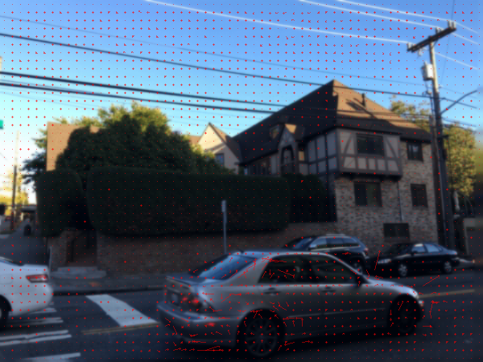
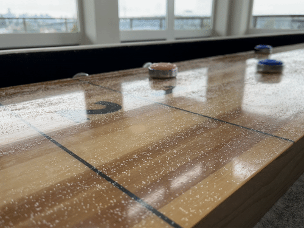
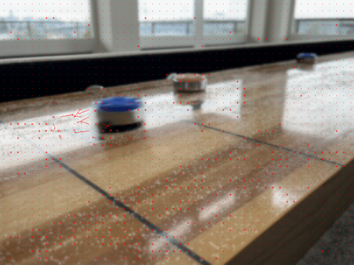
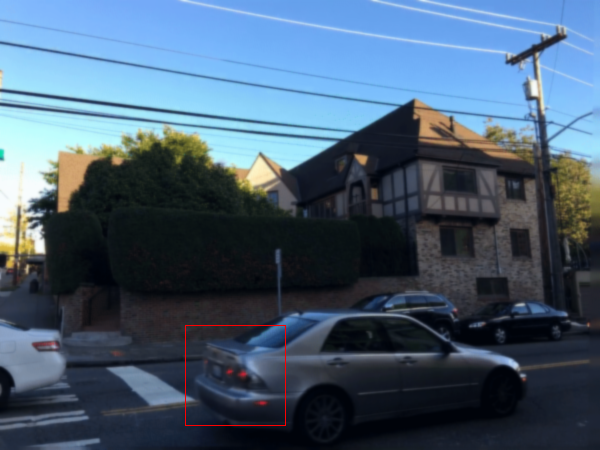
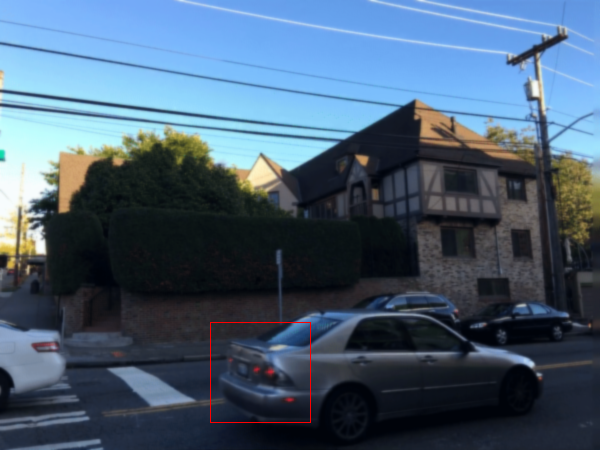
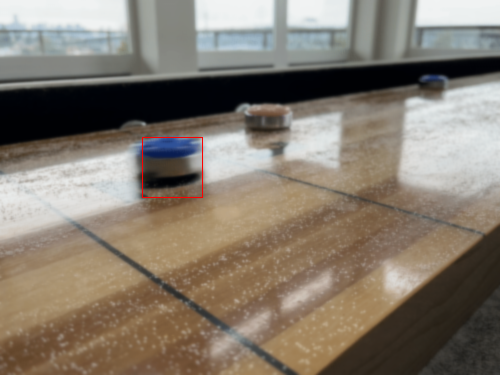
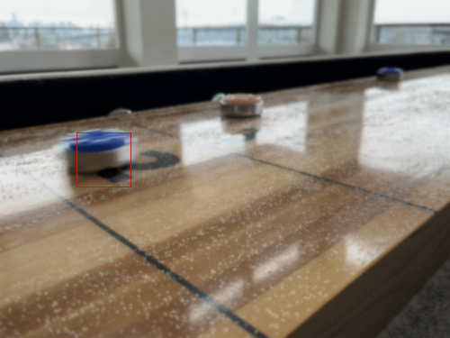
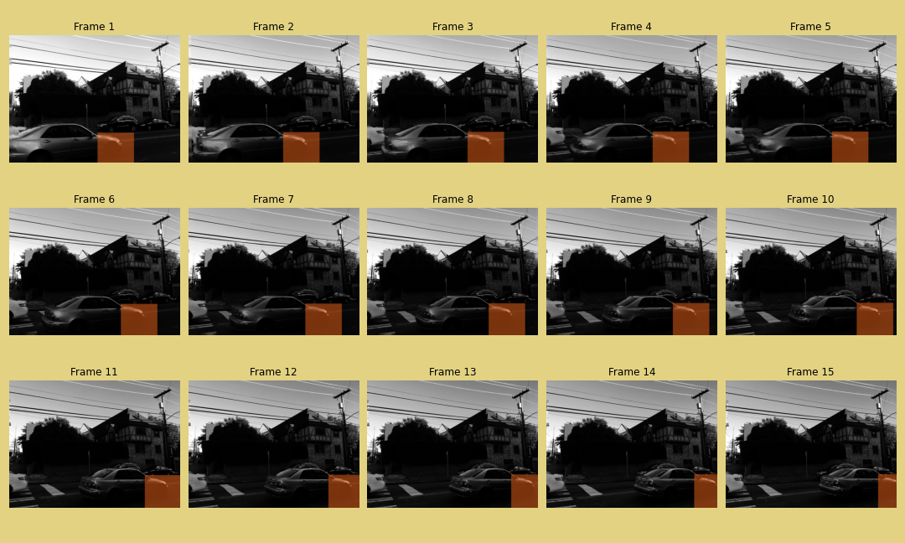
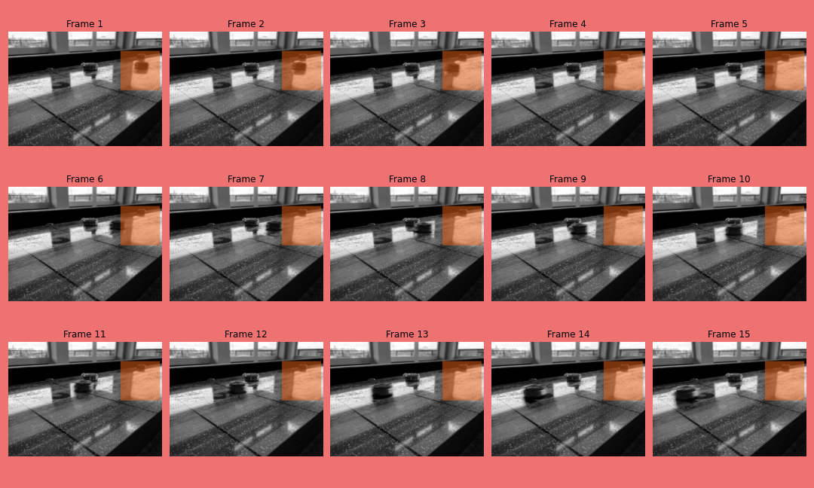
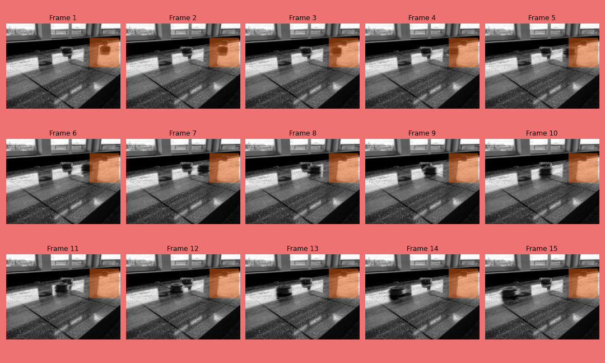

# Motion Estimation - Learning Reflection

**Author**: Tony Fu  
**Date**: August 27, 2023  
**Device**: MacBook Pro 16-inch, Late 2021 (M1 Pro)  
**Code**: [GitHub](https://github.com/tonyfu97/Digital-Image-Processing/tree/main/08_motion)  
**Reference**: Chapter 8 [*Digital Image Processing with C++: Implementing Reference Algorithms with the CImg Library* by Tschumperlé, Tilmant, Barra](https://www.amazon.com/Digital-Image-Processing-Implementing-Algorithms/dp/1032347538)

I also recommend Professor Shree Nayar's [lecture series](https://youtube.com/playlist?list=PL2zRqk16wsdoYzrWStffqBAoUY8XdvatV&si=mds5gPNjt4l43Pmw) on the on Optical Flow.

## 1. Horn-Schunck Optical Flow

### Problem Formulation

The Horn-Schunck method frames optical flow as an energy minimization problem by defining an energy function \(E\) that encapsulates two main terms:

1. **Data Term**: This measures how well the flow \( (u,v) \) is consistent with the pixel intensities in the given images. It's based on the brightness constancy constraint: \( I(x,y,t) = I(x+u, y+v, t+1) \), which states that the intensity of a point in an image should remain constant over time.

    \[
    E_{\text{data}} = \int \int (I_x u + I_y v + I_t)^2 \, dx \, dy
    \]

    The book also shows a variant of the data term (called the "direct method") that minize the squared difference between the shifted image and the original image.

2. **Smoothness Term**: To encourage smoothness in the flow field, Horn and Schunck include a regularization term. This term imposes a penalty on abrupt changes in \(u\) and \(v\).

    \[
    E_{\text{smooth}} = \int \int (\nabla u)^2 + (\nabla v)^2 \, dx \, dy
    \]

The combined energy function \( E \) to be minimized is:

\[
E = E_{\text{data}} + \alpha E_{\text{smooth}} =
\int \int \left[ (I_x u + I_y v + I_t)^2 + \alpha ((\nabla u)^2 + (\nabla v)^2) \right] \, dx \, dy
\]

### Minimization Process

To find the flow fields \( u \) and \( v \) that minimize this energy function, Horn and Schunck uses the Euler-Lagrange equations derived from \( E \).

1. Take the first variation of \( E \) with respect to \( u \) and \( v \) and set them to zero.

    \[
    \frac{\partial E}{\partial u} = 0 \quad \text{and} \quad \frac{\partial E}{\partial v} = 0
    \]

2. This results in a set of PDEs that are solved iteratively:

    \[
    I_x(I_x u + I_y v + I_t) + \alpha \Delta u = 0
    \]
  
    \[
    I_y(I_x u + I_y v + I_t) + \alpha \Delta v = 0
    \]

    In the original paper, Horn and Schunck approximated the Laplacians with:

    \[
    \nabla u = 4 (\bar{u} - u) \quad \text{and} \quad \nabla v = 4 (\bar{v} - v)
    \]

    where \( \bar{u} \) and \( \bar{v} \) are the averages of \( u \) and \( v \) in the 3-neighborhood of the current pixel.

3. The PDEs are solved iteratively until convergence (in the code, I set the maximum number of iterations to 100). The iterative update equations are:

    \[
    u = \bar{u} - \frac{I_x(I_x \bar{u} + I_y \bar{v} + I_t)}{4\alpha + I_x^2 + I_y^2}
    \quad \text{and} \quad
    v = \bar{v} - \frac{I_y(I_x \bar{u} + I_y \bar{v} + I_t)}{4\alpha + I_x^2 + I_y^2}
    \]

### Example

I use two frames from the following GIF as input to the Horn-Schunck optical flow algorithm:

The result optical flow is shown below:

## 2. Multi-Scale Optical Flow

### Leveraging Multi-Scale Approaches for Robust Optical Flow

Optical flow estimation involves capturing pixel-level movement between consecutive images. However, real-world scenarios often include varied and complex motions which may not be accurately captured at just a single scale. This is where our multi-scale approach comes in.

An example implementation of the algorithm scales down the image iteratively by factors of 2, beginning with the coarsest scale and moving towards the finest. At each scale, the Horn-Schunck algorithm is applied to estimate optical flow. The algorithm first captures larger motion patterns at these coarser scales and then refines these estimates as it proceeds to finer scales.

### Example

Notice that most arrows, which represent the optical flow, are concentrated on the moving car. However, you might also see that the arrow directions are not entirely accurate.

## 3. Lucas-Kanade Optical Flow

In the Horn-Schunck method, the energy function \(E\) is minimized globally over the entire image. This makes the problem severely under-determined, as there are two unknowns \(u\) and \(v\) for each pixel. To overcome this limitation, Lucas and Kanade proposed a local method that minimizes the energy function within a local window \(W\) around each pixel.

### Problem Formulation

Before introducing the window \(W\), let's first take a closer look at the **data term** used in the Horn-Schunck method. It is based on the brightness constancy constraint: \( I(x,y,t) = I(x+u, y+v, t+1) \), which states that the intensity of a point in an image should remain constant over time. Here, we take some steps to derive the optical flow equation. This derivation is also covered by Professor Shree Nayar in his [lecture](https://youtu.be/IjPLZ3hjU1A?si=vFxhDuyotewubWS6).

1. **First-Order Taylor Series Expansion**: We approximate the right-hand side of the equation around \((x, y, t)\):

    \[
    I(x+dx, y+dy, t+dt) \approx I(x, y, t) + \frac{\partial I}{\partial x} dx + \frac{\partial I}{\partial y} dy + \frac{\partial I}{\partial t} dt
    \]

2. **Combining Equations**: Using the initial assumption \(I(x, y, t) = I(x+dx, y+dy, t+dt)\), we get:

    \[
    I(x, y, t) + I_x dx + I_y dy + I_t dt = I(x, y, t)
    \]

3. **Simplification**: We subtract \(I(x, y, t)\) from both sides:

    \[
    I_x dx + I_y dy + I_t dt = 0
    \]

4. **Optical Flow Variables**: Finally, by dividing by \(dt\) and introducing \(u = dx/dt\) and \(v = dy/dt\), we arrive at the familiar optical flow equation:

    \[
    I_x u + I_y v + I_t = 0
    \]

### Minimization Process

The brightness constancy assumption, upon which the optical flow equation \(I_x u + I_y v + I_t = 0\) is based, may not hold true in all real-world scenarios. Therefore, it is unlikely that the equation will be exactly zero. Instead, we minimize the squared error term \(E(u, v)\) to find the best possible solution.

As alluded to above, the equation provides only a single constraint for the two unknowns \(u\) and \(v\), making the problem under-determined. Lucas-Kanade overcomes this limitation by applying this constraint within a local window \(W\) of pixels. We sum up the squared differences in brightness to form the error term \(E(u, v)\), making the problem mathematically tractable by providing enough equations to solve for the unknowns. This also improves the robustness of the optical flow estimate by averaging out inconsistencies and noise in the local region.

\[
E(u, v) = \sum_{W} (I_x u + I_y v + I_t)^2
\]

We can further expand the equation to:

\[
E(u, v) = \sum_{W} I_x^2 u^2 + 2 I_x I_y u v + I_y^2 v^2 + 2 I_x I_t u + 2 I_y I_t v + I_t^2
\]

To minimize \(E(u, v)\), we set its partial derivatives with respect to \(u\) and \(v\) to zero:

\[
\frac{\partial E}{\partial u} = 2 \sum_{W} (I_x^2 u + I_x I_y v + I_x I_t) = 0
\]
\[
\frac{\partial E}{\partial v} = 2 \sum_{W} (I_x I_y u + I_y^2 v + I_y I_t) = 0
\]

Rewriting these equations in matrix form, we get:

\[
A \mathbf{V} = \mathbf{b}
\]

Where:

\[
A = \begin{bmatrix}
\sum_{W} I_x^2 & \sum_{W} I_x I_y \\
\sum_{W} I_x I_y & \sum_{W} I_y^2
\end{bmatrix}
\]

\[
\mathbf{V} = \begin{bmatrix}
u \\
v
\end{bmatrix}
\]

\[
\mathbf{b} = \begin{bmatrix}
-\sum_{W} I_x I_t \\
-\sum_{W} I_y I_t
\end{bmatrix}
\]

To find the velocities \(u\) and \(v\), we typically solve the equation \(A \mathbf{V} = \mathbf{b}\) by computing \(\mathbf{V} = A^{-1} \mathbf{b}\). But wait, \(A\) is most likely non-square (and therefore non-invertible), so we can't compute its inverse. In such cases, we aim to find \(\mathbf{V}\) that minimizes the residual \(||A \mathbf{V} - \mathbf{b}||^2\). This *least squares* technique is commonly used in optimization problems:

\[
A^T A \mathbf{V} = A^T \mathbf{b}
\]

Here, \(A^T\) is the transpose of \(A\), and \(A^T A\) becomes a square matrix, making it possible to find an exact solution. The resulting \(\mathbf{V}\) is the least squares solution to the original equation.

### Examples

Applying the Lucas-Kanade optical flow algorithm to the same two frames from the previous section, we get the following result:

Here is another example:

And the result:

## 4. Lucas-Kanade Optical Flow with Eigenelement Analysis

### Why Eigenvalues?

Recall that in the [Harris-Stephen corner detection](../06_feature_extraction/#1-harris-stephens-corner-detector) section, we introduced the concept of a structure tensor, denoted \( M \), to capture local image structures. Similarly, in the Lucas-Kanade method, we utilize another structure tensor \(A^T A\). This \(2 \times 2\) matrix serves to encapsulate the local texture around a pixel.

The eigenvalues of this structure tensor guide us in determining how to process each pixel. The following table outlines the actions based on different conditions:

| Condition | Action |
|-----------|--------|
| Both eigenvalues \( \geq \tau_D \)| Compute the velocity using \( \text{localVelocity} = -A^T A \times A^T b \). |
| One eigenvalue \( \geq \tau_D \) | Project the estimated velocity onto the direction corresponding to the large eigenvalue.|
| Both eigenvalues \( < \tau_D \) | Ignore the pixel, as it is too smooth or noisy to provide reliable motion information. |

For a deeper dive into eigenvalue analysis, you can refer to Professor Shree Nayar's [lecture](https://youtu.be/6wMoHgpVUn8?si=J_qQ42REAsAvxOdh&t=243).

### Examples

To demonstrate the benefits of incorporating eigenvalue analysis, let's apply the Lucas-Kanade optical flow algorithm to the same sets of frames we used in previous sections. Below are the results:

I find the output to be cleaner compared to earlier methods.

## 5. Object Tracking by Cross-Correlation

### Algorithm Overview

Object tracking in a sequence of images can be accomplished by first identifying the object in the initial frame and creating a "template" of it. In subsequent frames, we cross-correlate this template with a local neighborhood of pixels to find the location that yields the highest correlation. This newly identified location represents the object's new position. This method is considered a form of sparse motion estimation because it doesn't involve comparing the entire image, but rather a small localized area.

### Examples

In the following image, we first identify the object in motion and enclose it within a box to create a template:

We then apply the cross-correlation algorithm to subsequent frames to track the object:

Here's another example:

And the tracking result:

## 6. Object Tracking by Phase Correlation

### Theoretical Background

Assume that two images differ only by a translation:

\[
I_2(x,y) = I_1(x + \Delta x, y + \Delta y)
\]

This can be viewed as the convolution of the first image with a delta function:

\[
I_2(x,y) = I_1(x,y) \ast \delta(x + \Delta x, y + \Delta y)
\]

Applying the Fourier transform to both sides gives:

\[
F_2(f_x, f_y) = F_1(f_x, f_y) \times e^{-j2\pi(f_x \Delta x + f_y \Delta y)}
\]

This equation will be crucial for deriving \(\Delta x\) and \(\Delta y\), the translational offsets between the images. We will later see how to go from \(F_2(f_x, f_y)\) and \(F_1(f_x, f_y)\) to \(e^{-j2\pi(f_x \Delta x + f_y \Delta y)}\).

### Algorithm Overview

The phase correlation approach is similar to cross-correlation. It involves creating an object template in the initial frame and then locating this object in subsequent frames. Instead of using the cross-correlation function, the method employs frequency domain transformations:

\[
F_1(f_x, f_y) = \mathcal{F}(I_1(x,y)) \quad \text{and} \quad F_2(f_x, f_y) = \mathcal{F}(I_2(x,y))
\]

The cross-power spectrum (\(CPS\) is formulated as:

\[
CPS
=
\frac{F_1 \overline{F_2}}{|F_1 \overline{F_2}|}
=
\frac{F_1 \overline{F_1 \times  e^{-j2\pi(f_x \Delta x + f_y \Delta y)}}}{|F_1 \overline{F_1 \times  e^{-j2\pi(f_x \Delta x + f_y \Delta y)}}|}
=\ldots =
e^{-j2\pi(f_x \Delta x + f_y \Delta y)}
\]

The proof (see the book) show that this eventually simplifies to \(e^{-j2\pi(f_x \Delta x + f_y \Delta y)}\), which can be inverse Fourier transformed to get \(\delta(x + \Delta x, y + \Delta y)\). In the code, the real and imaginary parts of the cross-power spectrum are separately handled as follows:

\[
CPS_{real} = F_{1real} F_{2real} + F_{1imag} F_{2imag}\\
CPS_{imag} = F_{1imag} F_{2real} - F_{1real} F_{2imag}
\]

\[
CPS = \frac{CPS_{real} + jCPS_{imag}}{|CPS_{real} + jCPS_{imag}| + \epsilon}
\]

The \(\epsilon\) term is added to avoid division by zero.

### Examples

We apply the phase correlation algorithm to the same frame sets used previously. The results demonstrate that it effectively tracks moving objects. 

However, the method is less reliable when the object lacks a distinct texture. For example, phase correlation fails in the following example:

## 7. Improve Object Tracking with Linear Kalman Filter

### Algorithm Overview

The idea of using phase correlation over spatial correlation comes from the fact that phase captures translation information across the entire region of interest. So why not extend this temporally? Instead of relying solely on the current frame to track an object, we could use previous frames to predict the object's location in the current one. This is the underlying concept of the Kalman filter.

The Kalman filter is a recursive algorithm designed to estimate the state of a system using a series of noisy measurements. It's a staple in control systems where the objective is to predict the system's future state based on past measurements. In our case, the system is the moving object, and the measurements are the object's positions in each frame.

Before diving deeper, let's first familiarize ourselves with the notations used in the Kalman filter:

### Notations

* **State \(\mathbf{s_i}\)**:
    \[
    \mathbf{s_i} = \begin{bmatrix} x_i, y_i, u_i, v_i \end{bmatrix}^T
    \]
    Here, \(x_i\) and \(y_i\) represent the object's coordinates in the \(i\)-th frame, and \(u_i\) and \(v_i\) signify its velocities.

* **Estimated Position \(\mathbf{z}_i\)**: This is calculated using phase correlation and represents the object's estimated location in the \(i\)-th frame.

* **State Transition Model \(\mathbf{D}_i\)**: This matrix describes how the state evolves over time. In our implementation, it's a constant matrix \( \mathbf{D} \):
    \[
    \mathbf{D} = \begin{bmatrix}
    1 & 0 & 1 & 0 \\
    0 & 1 & 0 & 1 \\
    0 & 0 & 1 & 0 \\
    0 & 0 & 0 & 1
    \end{bmatrix}
    \]

* **Observation Model \(\mathbf{M}_i\)**: It translates the state into position. Our observation model is simply the constant matrix \( \mathbf{M} \), meaning that it simply extracts \(x_i\) and \(y_i\) from \(\mathbf{s}_i\):
    \[
    \mathbf{M} = \begin{bmatrix}
    1 & 0 & 0 & 0\\
    0 & 1 & 0 & 0
    \end{bmatrix}
    \]

* **Model Covariance \(\Sigma_{d, i}\)** and **Measurement Covariance \(\Sigma_{m, i}\)**: These signify the uncertainty in the model and the measurements, respectively.

    \[
    \Sigma_D = \begin{pmatrix}
    5 & 0 & 0 & 0 \\
    0 & 5 & 0 & 0 \\
    0 & 0 & 1 & 0 \\
    0 & 0 & 0 & 1
    \end{pmatrix}
    \]
    \[
    \Sigma_M = \begin{pmatrix}
    50 & 0 \\
    0 & 50
    \end{pmatrix}
    \]

    The values are set to represent our belief about the model and measurement noise. Essentially, larger values indicate greater uncertainty. They serve to balance the model prediction against new observations. 

* **State Covariance \(\Sigma_i\)**: This measures the uncertainty in our state estimate.

* **Kalman Gain \(\mathbf{K}_i\)**: This weighting factor decides how much we should trust the new measurements relative to our model prediction.

### Kalman Filter Equations

#### Prediction

Here we predict the state and its uncertainty.
\[
\mathbf{s}_i = \mathbf{D} \mathbf{s}_{i-1} \\
\Sigma_i = \Sigma_{d, i} + \mathbf{D} \Sigma_{i-1} \mathbf{D}^T
\]

#### Update/Correction

In this phase, we update the predicted state based on new measurements.
\[
\mathbf{K}_i = \Sigma_i \mathbf{M}^T (\mathbf{M} \Sigma_i \mathbf{M}^T + \Sigma_{m, i})^{-1} \\
\mathbf{s}_i = \mathbf{s}_i + \mathbf{K}_i (\mathbf{z}_i - \mathbf{M} \mathbf{s}_i) \\
\Sigma_i = (I - \mathbf{K}_i \mathbf{M}) \Sigma_i
\]

Notice that the larger the \(\Sigma_{m, i}\), the smaller the Kalman gain \(\mathbf{K}_i\). This means that we trust the model more than the measurements. On the other hand, if the measurement noise is small, the Kalman gain will be large, and we will trust the measurements more than the model.

### Examples

When the Kalman filter is combined with phase correlation, tracking may initially seem sluggish but eventually catches up. This adaptation period is common as the Kalman filter attempts to balance noisy measurements from the phase correlation with its own predictions.

As expected, when phase correlation fails in the shuffleboard example, the Kalman filter also fails to track the object.

