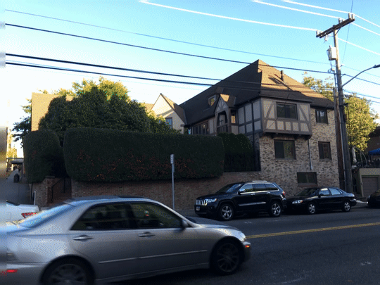
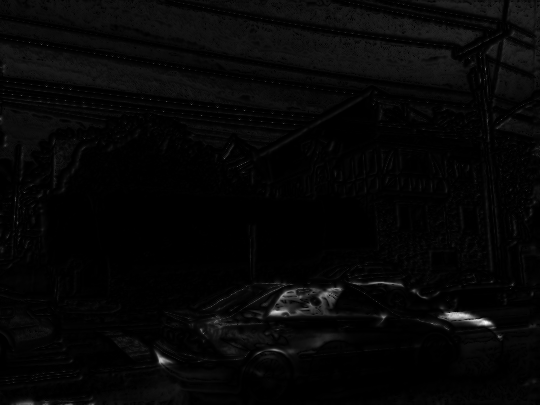

# Motion Estimation

**Author**: Tony Fu  
**Date**: August 27, 2023  
**Device**: MacBook Pro 16-inch, Late 2021 (M1 Pro)  
**Code**: [GitHub](https://github.com/tonyfu97/Digital-Image-Processing/tree/main/08_motion)  
**Reference**: Chapter 8 [*Digital Image Processing with C++: Implementing Reference Algorithms with the CImg Library* by Tschumperlé, Tilmant, Barra](https://www.amazon.com/Digital-Image-Processing-Implementing-Algorithms/dp/1032347538)

## 1. Horn-Schunck Optical Flow

### Problem Formulation

The Horn-Schunck method frames optical flow as an energy minimization problem by defining an energy function \(E\) that encapsulates two main terms:

1. **Data Term**: This measures how well the flow \( (u,v) \) is consistent with the pixel intensities in the given images. It's based on the brightness constancy constraint: \( I(x,y,t) = I(x+u, y+v, t+1) \), which states that the intensity of a point in an image should remain constant over time.

    \[
    E_{\text{data}} = \int \int (I_x u + I_y v + I_t)^2 \, dx \, dy
    \]

    The book also shows a variant of the data term (called the "direct method") that minize the squared difference between the shifted image and the original image.

2. **Smoothness Term**: To encourage smoothness in the flow field, Horn and Schunck include a regularization term. This term imposes a penalty on abrupt changes in \(u\) and \(v\).

    \[
    E_{\text{smooth}} = \int \int (\nabla u)^2 + (\nabla v)^2 \, dx \, dy
    \]

The combined energy function \( E \) to be minimized is:

\[
E = E_{\text{data}} + \alpha E_{\text{smooth}} =
\int \int \left[ (I_x u + I_y v + I_t)^2 + \alpha ((\nabla u)^2 + (\nabla v)^2) \right] \, dx \, dy
\]

### Minimization Process

To find the flow fields \( u \) and \( v \) that minimize this energy function, Horn and Schunck uses the Euler-Lagrange equations derived from \( E \).

1. Take the first variation of \( E \) with respect to \( u \) and \( v \) and set them to zero.

    \[
    \frac{\partial E}{\partial u} = 0 \quad \text{and} \quad \frac{\partial E}{\partial v} = 0
    \]

2. This results in a set of PDEs that are solved iteratively:

    \[
    I_x(I_x u + I_y v + I_t) + \alpha \Delta u = 0
    \]
  
    \[
    I_y(I_x u + I_y v + I_t) + \alpha \Delta v = 0
    \]

    In the original paper, Horn and Schunck approximated the Laplacians with:

    \[
    \nabla u = 4 (\bar{u} - u) \quad \text{and} \quad \nabla v = 4 (\bar{v} - v)
    \]

    where \( \bar{u} \) and \( \bar{v} \) are the averages of \( u \) and \( v \) in the 3-neighborhood of the current pixel.

3. The PDEs are solved iteratively until convergence (in the code, I set the maximum number of iterations to 100). The iterative update equations are:

    \[
    u = \bar{u} - \frac{I_x(I_x \bar{u} + I_y \bar{v} + I_t)}{4\alpha + I_x^2 + I_y^2}
    \quad \text{and} \quad
    v = \bar{v} - \frac{I_y(I_x \bar{u} + I_y \bar{v} + I_t)}{4\alpha + I_x^2 + I_y^2}
    \]

### Example

I use two frames from the following GIF as input to the Horn-Schunck optical flow algorithm:

The result optical flow is shown below:

## 2. Multi-Scale Optical Flow

### Leveraging Multi-Scale Approaches for Robust Optical Flow

Optical flow estimation involves capturing pixel-level movement between consecutive images. However, real-world scenarios often include varied and complex motions which may not be accurately captured at just a single scale. This is where our multi-scale approach comes in.

An example implementation of the algorithm scales down the image iteratively by factors of 2, beginning with the coarsest scale and moving towards the finest. At each scale, the Horn-Schunck algorithm is applied to estimate optical flow. The algorithm first captures larger motion patterns at these coarser scales and then refines these estimates as it proceeds to finer scales.

### Example

Notice that most arrows, which represent the optical flow, are concentrated on the moving car. However, you might also see that the arrow directions are not entirely accurate.

## 3. Lucas-Kanade Optical Flow

