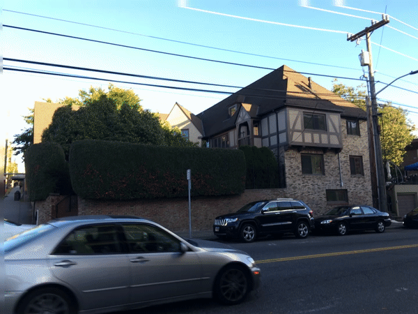

# Motion Estimation

**Author**: Tony Fu  
**Date**: August 27, 2023  
**Device**: MacBook Pro 16-inch, Late 2021 (M1 Pro)  
**Code**: [GitHub](https://github.com/tonyfu97/Digital-Image-Processing/tree/main/08_motion)  
**Reference**: Chapter 8 [*Digital Image Processing with C++: Implementing Reference Algorithms with the CImg Library* by Tschumperlé, Tilmant, Barra](https://www.amazon.com/Digital-Image-Processing-Implementing-Algorithms/dp/1032347538)

## 1. Horn-Schunck Optical Flow

### Problem Formulation

The Horn-Schunck method frames optical flow as an energy minimization problem by defining an energy function \(E\) that encapsulates two main terms:

1. **Data Term**: This measures how well the flow \( (u,v) \) is consistent with the pixel intensities in the given images. It's based on the brightness constancy constraint: \( I(x,y,t) = I(x+u, y+v, t+1) \), which states that the intensity of a point in an image should remain constant over time.

    \[
    E_{\text{data}} = \int \int (I_x u + I_y v + I_t)^2 \, dx \, dy
    \]

    The book also shows a variant of the data term (called the "direct method") that minize the squared difference between the shifted image and the original image.

2. **Smoothness Term**: To encourage smoothness in the flow field, Horn and Schunck include a regularization term. This term imposes a penalty on abrupt changes in \(u\) and \(v\).

    \[
    E_{\text{smooth}} = \int \int (\nabla u)^2 + (\nabla v)^2 \, dx \, dy
    \]

The combined energy function \( E \) to be minimized is:

\[
E = E_{\text{data}} + \alpha E_{\text{smooth}} =
\int \int \left[ (I_x u + I_y v + I_t)^2 + \alpha ((\nabla u)^2 + (\nabla v)^2) \right] \, dx \, dy
\]

### Minimization Process

To find the flow fields \( u \) and \( v \) that minimize this energy function, Horn and Schunck uses the Euler-Lagrange equations derived from \( E \).

1. Take the first variation of \( E \) with respect to \( u \) and \( v \) and set them to zero.

    \[
    \frac{\partial E}{\partial u} = 0 \quad \text{and} \quad \frac{\partial E}{\partial v} = 0
    \]

2. This results in a set of PDEs that are solved iteratively:

    \[
    I_x(I_x u + I_y v + I_t) + \alpha \Delta u = 0
    \]
  
    \[
    I_y(I_x u + I_y v + I_t) + \alpha \Delta v = 0
    \]

    In the original paper, Horn and Schunck approximated the Laplacians with:

    \[
    \nabla u = 4 (\bar{u} - u) \quad \text{and} \quad \nabla v = 4 (\bar{v} - v)
    \]

    where \( \bar{u} \) and \( \bar{v} \) are the averages of \( u \) and \( v \) in the 3-neighborhood of the current pixel.

3. The PDEs are solved iteratively until convergence (in the code, I set the maximum number of iterations to 100). The iterative update equations are:

    \[
    u = \bar{u} - \frac{I_x(I_x \bar{u} + I_y \bar{v} + I_t)}{4\alpha + I_x^2 + I_y^2}
    \quad \text{and} \quad
    v = \bar{v} - \frac{I_y(I_x \bar{u} + I_y \bar{v} + I_t)}{4\alpha + I_x^2 + I_y^2}
    \]

### Example

I use two frames from the following GIF as input to the Horn-Schunck optical flow algorithm:

The result optical flow is shown below:

## 2. Multi-Scale Optical Flow

### Leveraging Multi-Scale Approaches for Robust Optical Flow

Optical flow estimation involves capturing pixel-level movement between consecutive images. However, real-world scenarios often include varied and complex motions which may not be accurately captured at just a single scale. This is where our multi-scale approach comes in.

An example implementation of the algorithm scales down the image iteratively by factors of 2, beginning with the coarsest scale and moving towards the finest. At each scale, the Horn-Schunck algorithm is applied to estimate optical flow. The algorithm first captures larger motion patterns at these coarser scales and then refines these estimates as it proceeds to finer scales.

### Example

Notice that most arrows, which represent the optical flow, are concentrated on the moving car. However, you might also see that the arrow directions are not entirely accurate.

## 3. Lucas-Kanade Optical Flow

In the Horn-Schunck method, the energy function \(E\) is minimized globally over the entire image. This makes the problem severely under-determined, as there are two unknowns \(u\) and \(v\) for each pixel. To overcome this limitation, Lucas and Kanade proposed a local method that minimizes the energy function within a local window \(W\) around each pixel.

### Problem Formulation

Before introducing the window \(W\), let's first take a closer look at the **data term** used in the Horn-Schunck method. It is based on the brightness constancy constraint: \( I(x,y,t) = I(x+u, y+v, t+1) \), which states that the intensity of a point in an image should remain constant over time. Here, we take some steps to derive the optical flow equation.

1. **First-Order Taylor Series Expansion**: We approximate the right-hand side of the equation around \((x, y, t)\):

    \[
    I(x+dx, y+dy, t+dt) \approx I(x, y, t) + \frac{\partial I}{\partial x} dx + \frac{\partial I}{\partial y} dy + \frac{\partial I}{\partial t} dt
    \]

2. **Combining Equations**: Using the initial assumption \(I(x, y, t) = I(x+dx, y+dy, t+dt)\), we get:

    \[
    I(x, y, t) + I_x dx + I_y dy + I_t dt = I(x, y, t)
    \]

3. **Simplification**: We subtract \(I(x, y, t)\) from both sides:

    \[
    I_x dx + I_y dy + I_t dt = 0
    \]

4. **Optical Flow Variables**: Finally, by dividing by \(dt\) and introducing \(u = dx/dt\) and \(v = dy/dt\), we arrive at the familiar optical flow equation:

    \[
    I_x u + I_y v + I_t = 0
    \]

### Minimization Process

The brightness constancy assumption, upon which the optical flow equation \(I_x u + I_y v + I_t = 0\) is based, may not hold true in all real-world scenarios. Therefore, it is unlikely that the equation will be exactly zero. Instead, we minimize the squared error term \(E(u, v)\) to find the best possible solution.

As alluded to above, the equation provides only a single constraint for the two unknowns \(u\) and \(v\), making the problem under-determined. Lucas-Kanade overcomes this limitation by applying this constraint within a local window \(W\) of pixels. We sum up the squared differences in brightness to form the error term \(E(u, v)\), making the problem mathematically tractable by providing enough equations to solve for the unknowns. This also improves the robustness of the optical flow estimate by averaging out inconsistencies and noise in the local region.

\[
E(u, v) = \sum_{W} (I_x u + I_y v + I_t)^2
\]

We can further expand the equation to:

\[
E(u, v) = \sum_{W} I_x^2 u^2 + 2 I_x I_y u v + I_y^2 v^2 + 2 I_x I_t u + 2 I_y I_t v + I_t^2
\]

To minimize \(E(u, v)\), we set its partial derivatives with respect to \(u\) and \(v\) to zero:

\[
\frac{\partial E}{\partial u} = 2 \sum_{W} (I_x^2 u + I_x I_y v + I_x I_t) = 0
\]
\[
\frac{\partial E}{\partial v} = 2 \sum_{W} (I_x I_y u + I_y^2 v + I_y I_t) = 0
\]

Rewriting these equations in matrix form, we get:

\[
A \mathbf{V} = \mathbf{b}
\]

Where:

\[
A = \begin{bmatrix}
\sum_{W} I_x^2 & \sum_{W} I_x I_y \\
\sum_{W} I_x I_y & \sum_{W} I_y^2
\end{bmatrix}
\]

\[
\mathbf{V} = \begin{bmatrix}
u \\
v
\end{bmatrix}
\]

\[
\mathbf{b} = \begin{bmatrix}
-\sum_{W} I_x I_t \\
-\sum_{W} I_y I_t
\end{bmatrix}
\]

To find the velocities \(u\) and \(v\), we typically solve the equation \(A \mathbf{V} = \mathbf{b}\) by computing \(\mathbf{V} = A^{-1} \mathbf{b}\). But wait, \(A\) is most likely non-square (and therefore non-invertible), so we can't compute its inverse. In such cases, we aim to find \(\mathbf{V}\) that minimizes the residual \(||A \mathbf{V} - \mathbf{b}||^2\). This *least squares* technique is commonly used in optimization problems:

\[
A^T A \mathbf{V} = A^T \mathbf{b}
\]

Here, \(A^T\) is the transpose of \(A\), and \(A^T A\) becomes a square matrix, making it possible to find an exact solution. The resulting \(\mathbf{V}\) is the least squares solution to the original equation.

### Example

Applying the Lucas-Kanade optical flow algorithm to the same two frames from the previous section, we get the following result:

Here is another example:

And the result:

