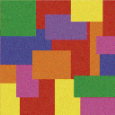
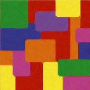

# Multispectral Image Processing - Learning Reflection

**Author**: Tony Fu  
**Date**: August 30, 2023  
**Device**: MacBook Pro 16-inch, Late 2021 (M1 Pro)  
**Code**: [GitHub](https://github.com/tonyfu97/Digital-Image-Processing/tree/main/09_multispectral)  
**Reference**: Chapter 9 [*Digital Image Processing with C++: Implementing Reference Algorithms with the CImg Library* by Tschumperlé, Tilmant, Barra](https://www.amazon.com/Digital-Image-Processing-Implementing-Algorithms/dp/1032347538)

## 1. Principal Component Analysis (PCA) for Reducing Color Channels

Principal Component Analysis (PCA) is a widely-used technique for dimensionality reduction. Here, the book introduces PCA in the context of reducing the number of color channels in images, but it is also frequently used in image processing tasks such as image compression and appearance-based object recognition (not covered). For a more in-depth understanding, please refer to these lectures: [Lecture 1](https://youtu.be/M6fBAzcw1Ps?si=zJfF_4zNEiaa8jnf), [Lecture 2](https://youtu.be/DcngAJXMoRo?si=3P7mRL9JUfmrVyh4).

### Algorithm Walkthrough

#### 1. Data Standardization

The first step is to standardize the data. This is accomplished by subtracting the mean and dividing by the standard deviation:

\[
\mathbf{Z} = \frac{\mathbf{X} - \bar{\mathbf{X}}}{\sigma}
\]

Here, \( \mathbf{X} \) is a column of the data matrix, \( \bar{\mathbf{X}} \) is the mean of \( \mathbf{X} \), and \( \sigma \) is the standard deviation of \( \mathbf{X} \).

#### 2. Calculate the Correlation Matrix

Next, calculate the correlation matrix:

\[
\mathbf{R} = \mathbf{Z}^T \times \mathbf{Z}
\]

Note that usually, the correlation matrix is further divided by the number of samples, but this is not done here.

#### 3. Compute the Eigenvalues and Eigenvectors

Using `CImg<T>::get_symmetric_eigen()`, we can obtain the eigenvalues and eigenvectors of the correlation matrix, sorted in descending order. Mathematically, this involves solving the following equation:

\[
\mathbf{R} \times \mathbf{v} = \lambda \times \mathbf{v}
\]

Here, \( \mathbf{v} \) is the eigenvector and \( \lambda \) is the eigenvalue.

#### 4. Select Principal Components

This step involves selecting the top \( k \) columns from \(\mathbf{v}\). In the code, we use the principal component(s) that account for 90% of the variance in the data.

#### 5. Transform Original Dataset

Finally, transform the original dataset by multiplying it with the selected principal components:

\[
\mathbf{X}_{\text{pca}} = \mathbf{X} \times \mathbf{v}
\]

### Example

Here we perform PCA on the following color image:

The first principal component, which accounts for over 90% of the variation, is shown below. This appears to be a grayscale version of the original image:

Interestingly, the second principal component highlights the cat toy in the background:

And here is the third principal component:

## 2. Color Spaces

| Color Space | Description | Channels | Applications |
|-------------|-------------|----------|--------------|
| RGB         | Red, Green, Blue | 3 | General-purpose, display, image & video capture |
| Grayscale   | Luminance | 1 | Image analysis, older video transmission |
| HSV         | Hue, Saturation, Value | 3 | Image analysis, computer vision, graphics |
| HSL         | Hue, Saturation, Lightness | 3 | Image analysis, computer vision, graphics |
| YCbCr       | Luma, Blue-difference, Red-difference | 3 | Video compression, broadcast |
| Lab         | Lightness, a (Green to Red), b (Blue to Yellow) | 3 | Color conversion, image analysis |
| YUV         | Luminance, Chrominance U, Chrominance V | 3 | Video compression, broadcast |
| CMYK        | Cyan, Magenta, Yellow, Black | 4 | Printing |
| XYZ         | Standardized RGB | 3 | Color science, conversions |
| sRGB        | Standard RGB | 3 | Web, general-purpose graphics |
| L*a*b*      | Lightness, a*, b* | 3 | Color analysis, computer vision |

## 3. Median Filtering for Color Images

### Algorithm Overview

While we have explored median filtering [before](../05_filtering/#2-median-filter), it was specifically for black and white images. The concept gets more complicated when extended to color images. In this case, we start by converting the image from RGB to Lab color space. For each pixel, we consider a \(5 \times 5 \times 2\) neighborhood, \( \mathbf{V} \), around it in the format \(x, y, c\).

\[
\mathbf{V} = \begin{pmatrix}
\mathbf{v}_a \\
\mathbf{v}_b
\end{pmatrix}
\]

Here, \( \mathbf{v}_a \) and \( \mathbf{v}_b \) are \(5 \times 5\) matrices corresponding to the \( a \) and \( b \) channels of the Lab color space. Note that although \( \mathbf{v}_L \) exists, it's not used in the distance calculation for median filtering in this algorithm.

The distance metric \( d \) is calculated using the \( a \) and \( b \) components. Specifically, \( d \) for each pixel \( i, j \) in the \( 5 \times 5 \) window is computed as the sum of Euclidean distances to the \( a \) and \( b \) values of all other pixels \( u, v \) in the same window:

\[
d_{ij} = \sum_{u,v} \sqrt{(a_{ij} - a_{uv})^2 + (b_{ij} - b_{uv})^2}
\]

Where \( a_{ij} \) and \( b_{ij} \) denote the \( a \) and \( b \) components at pixel \( i,j \), and \( a_{uv} \) and \( b_{uv} \) are the \( a \) and \( b \) components at pixel \( u,v \).

The pixel with the minimum \( d \) value is then selected as the median pixel and replaces the central pixel in the output image. This operation is repeated for each \( 5 \times 5 \) window in the image.

### Example

Consider a noisy image with large blocks of color:

After applying the median filter, the noise is effectively reduced:

