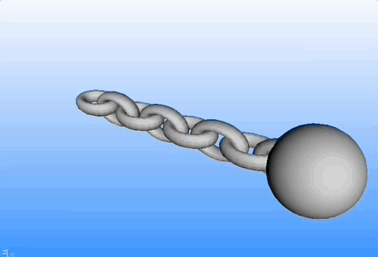

# 3D Visualization - Learning Reflection

**Author**: Tony Fu  
**Date**: August 30, 2023  
**Device**: MacBook Pro 16-inch, Late 2021 (M1 Pro)  
**Code**: [GitHub](https://github.com/tonyfu97/Digital-Image-Processing/tree/main/10_3d)  
**Reference**: Chapter 10 [*Digital Image Processing with C++: Implementing Reference Algorithms with the CImg Library* by Tschumperlé, Tilmant, Barra](https://www.amazon.com/Digital-Image-Processing-Implementing-Algorithms/dp/1032347538)

## 1. Introduction

### 1.1 3D Primitives in CImg
CImg has functions to create several types of 3D primitives, including:

- `sphere3d()`: Creates a sphere.
- `torus3d()`: Creates a torus.
- `cylinder3d()`: Creates a cylinder.
- `box3d()`: Creates a box or parallelepiped.

To use these, you generally create a `CImg<>` object for points and a `CImgList<unsigned int>` object for primitives, then fill them using these functions:

```cpp
CImg<> points;
CImgList<unsigned int> primitives;
points = CImg<>::sphere3d(primitives, radius);
```

### 1.2 Define Your Own 3D Object
You can define your own 3D object by providing the following four datasets:

1. **Points (Vertices)**: A `CImg<>` object that holds the 3D coordinates of each vertex.
2. **Primitives**: A `CImgList<unsigned int>` object that describes how points connect to form primitives like triangles or quadrangles.
3. **Materials (Optional)**: To specify colors or textures.
4. **Opacities (Optional)**: To specify the transparency level of each primitive.

For a simple example, you could define a 3D triangle:

```cpp
CImg<> points("0,0,0  1,0,0  0,1,0");
CImgList<unsigned int> primitives("3,0,1,2");  // A single triangle using points 0,1,2
```

### 1.3 Merging Objects
You can use `append_object3d()` to merge two 3D objects:

```cpp
g_points.append_object3d(g_primitives, points, primitives);
```

### 1.4 Translate, Rotate, Scale, Shear
These transformations can be applied using methods like:

- `shift_object3d(dx, dy, dz)`: Translates the object.
- `rotate_object3d(ax, ay, az, angle)`: Rotates the object.
- `resize_object3d(sx, sy, sz)`: Scales the object.
- `shear_object3d(xy, xz, yx, yz, zx, zy)`: Shears the object.

### 1.5 Displaying Objects
To display the 3D object, you can use the `display_object3d()` method:

```cpp
background.display_object3d("3D Object", points, primitives);
```

Here, `background` is a `CImg<>` object you can create as a background for rendering the 3D scene.

### Example

The book's script [`simple_3d.cpp`](https://github.com/tonyfu97/Digital-Image-Processing/tree/main/10_3d/simple_3d.cpp) merge a few toruses and spheres to create a chain with a ball at the end:




## 2. 

