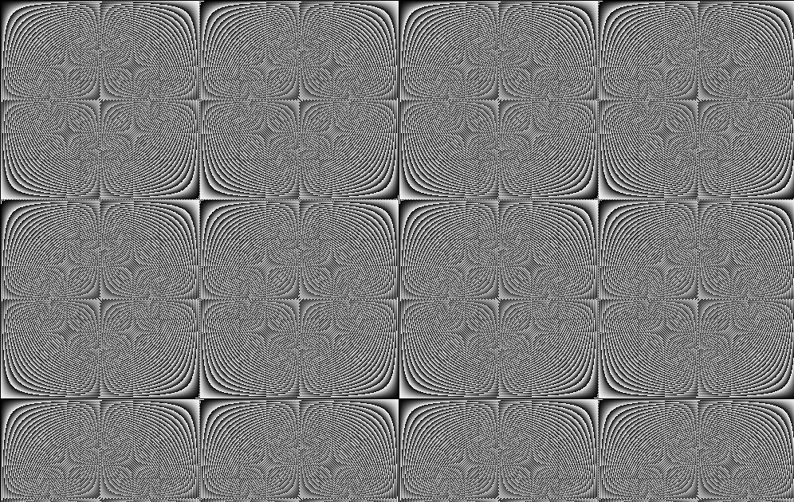

# Math Expressions in CImg's Fill Method

**Author**: Tony Fu  
**Date**: August 19, 2023  
**Device**: MacBook Pro 16-inch, Late 2021 (M1 Pro)  
**Code**: [GitHub](https://github.com/tonyfu97/Digital-Image-Processing/tree/main/appendix_1)

This page provides a guide to using mathematical expressions within the `CImg<unsigned char>::fill()` method of the CImg library.

## Syntax and Operators

Mathematical expressions can include the following:

- Basic arithmetic: `+`, `-`, `*`, `/`, `%`
- Trigonometric functions: `sin`, `cos`, `tan`, etc.
- Logarithmic functions: `log`, `exp`, etc.

## Variables

- `I`: Represents the current pixel value. For example, `I*2` would double the intensity of every pixel.
- `J(x, y)`: Refers to the neighboring pixel values at relative coordinates `(x, y)`
- `x`, `y`, `z`, `c`: Represents the coordinates of the current pixel.

## Conditional Expressions

You can use conditional expressions like `condition ? value_if_true : value_if_false`.

## Boolean Logic

Use logical operators like `&&` (AND), `||` (OR), and `!` (NOT) for conditional logic, and comparison operators (`==`, `!=`, `<`, `<=`, `>`, `>=`) are also available.

## Examples

### 0. Original Image


### 1. Doubling the Intensity of an Image

```cpp
CImg<unsigned char> img("image.jpg");
img.fill("I*2", true);
```


### 2. Inverting an Image

```cpp
CImg<unsigned char> img("image.jpg");
img.fill("255-I", true);
```


### 3. Spiral Effect

```cpp
CImg<unsigned char> img("image.jpg");
img_spiral.fill("(x*y)%500",true);
```



### 4. Conditional Operations

```cpp
CImg<unsigned char> img("image.jpg");
img.fill("I*(I!=J(1,0) || I!=J(0,1)?0:1)", true);
```


