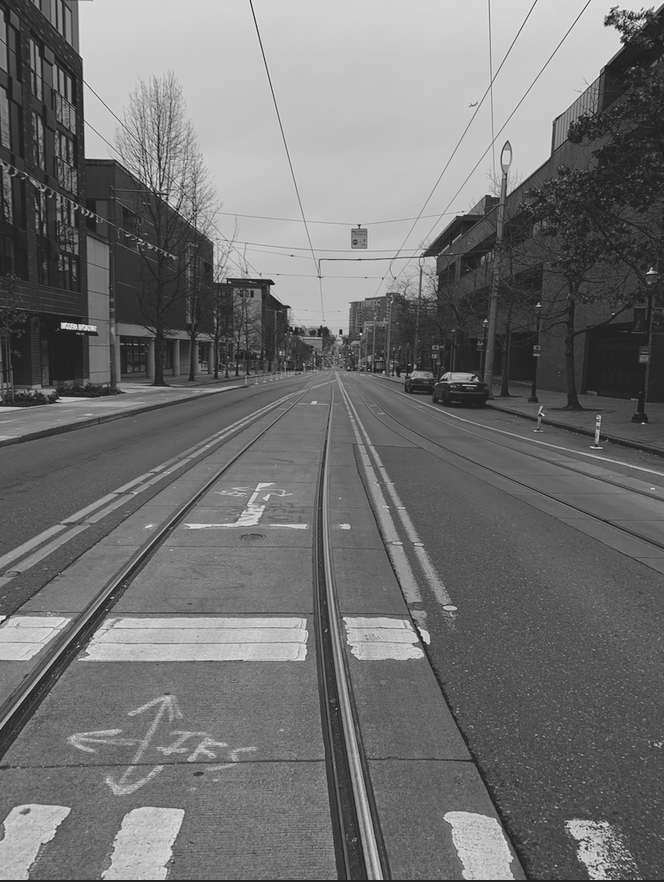

# JPEG Compression - Learning Reflection

**Author**: Tony Fu  
**Date**: August 30, 2023  
**Device**: MacBook Pro 16-inch, Late 2021 (M1 Pro)  
**Code**: [GitHub](https://github.com/tonyfu97/Digital-Image-Processing/tree/main/appendix_2)  
**Reference**: Chapter 11.1 [*Digital Image Processing with C++: Implementing Reference Algorithms with the CImg Library* by Tschumperlé, Tilmant, Barra](https://www.amazon.com/Digital-Image-Processing-Implementing-Algorithms/dp/1032347538)

## Algorithm Walkthrough

I highly recommend Branch Education's [video](https://youtu.be/Kv1Hiv3ox8I?si=48ut6ozN3T9cwUHR) on this topic. JPEG is a lossy compression algorithm that uses a series of clever steps to reduce the size of an image. The algorithm is as follows:

### 1. Color Space Conversion

The first step is to convert the image from RGB to YCbCr color space. The human eye is more sensitive to changes in luminance than chrominance. The YCbCr color space separates luminance (Y) from chrominance (Cb and Cr). Note that in the [book's code](https://github.com/tonyfu97/Digital-Image-Processing/tree/main/appendix_2/jpeg.cpp), the author uses the norm of the RGB values to calculate luminance, which is a simplified but effective approach for this example.

Original image:

Converted to luminance:

### 2. Pre-calculated Cosine Values

The `genCosValues()` function generates a matrix of pre-calculated cosine values used in the DCT and IDCT functions. The formula for cosine values is:

\[
\mathbf{C}(x, f) = \cos \left( \frac{\pi}{2N} (2x + 1) f \right)
\]

Here, \(N = 8\).

Each row corresponds to a frequency \(f\).

### 3. Divide Image into Blocks

The image is divided into blocks \( \mathbf{B} \) of size \( N \times N \). Subsampling is commonly done here, but the book doesn't cover that aspect.

### 4. Level Shift

The level shift operation subtracts 128 from each pixel value, centering them around 0. This improves numerical stability in the DCT and IDCT calculations.

### 5. Discrete Cosine Transform (DCT)

The `JPEG_DCT()` function calculates the Discrete Cosine Transform of a given image block using:

\[
\mathbf{DCT}(\mathbf{B}) = \mathbf{C} \mathbf{B} \mathbf{C}^T
\]

Alternatively, using index notation:

\[
\mathbf{DCT}(\mathbf{B})_{f, g} = \sum_{x=0}^{N-1} \sum_{y=0}^{N-1} \mathbf{C}(x, f) \mathbf{B}(x, y) \mathbf{C}(y, g)
\]

To normalize the transform and ensure it is unitary, the whole block is multiplied by \( \frac{2}{N} \cdot c(i) \cdot c(j) \), where:
- \( c(i) = \frac{1}{\sqrt{2}} \) if \( i = 0 \); otherwise \( c(i) = 1 \)
- \( c(j) = \frac{1}{\sqrt{2}} \) if \( j = 0 \); otherwise \( c(j) = 1 \)

### 6. Quantization

The quantization step is where most of the compression occurs. In `JPEGEncoder()`, the DCT coefficients are quantized using a standard Quantization matrix \( Q \) scaled by a quality factor:

\[
\mathbf{DCT_{Q}} = \frac{\mathbf{DCT}}{Q \times \text{quality}}
\]

### 7. Zigzag Scanning

Zigzag scanning is usually performed to create a 1D array of DCT coefficients, enabling more efficient encoding. The step isn't implemented in the book's code.

### 8. Run-Length Encoding (RLE)

Run-Length Encoding is often used to represent repetitive sequences in a more compact form. This is not implemented in the book's code.

### 9. Huffman Encoding

Huffman encoding is a method for lossless data compression. It assigns shorter bit sequences to more common coefficients. This is not implemented in the book's code.

### 10. Write to File

The code doesn't manage JPEG-specific metadata or file headers, so it doesn't generate a standard JPEG file.

### Final Result

Using a quality factor of 1, the final result is:

With quality factors of 10, 50, and 90:

