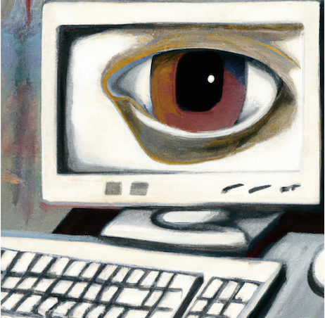
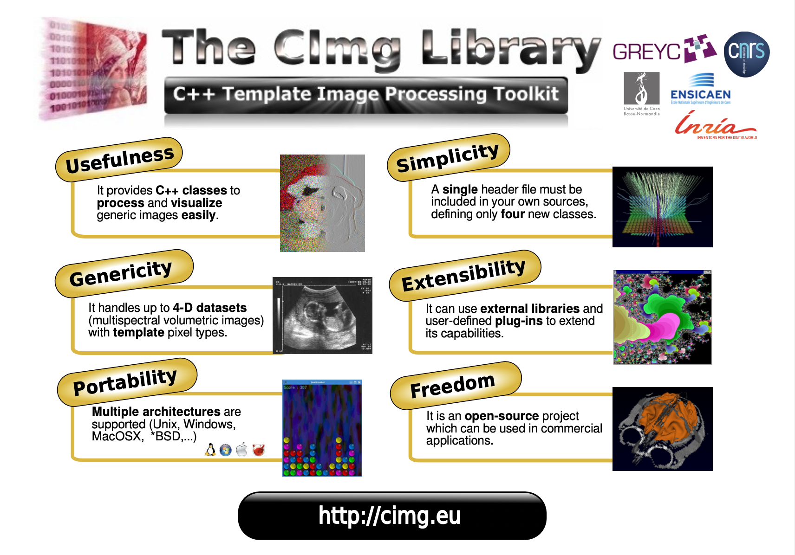

# Digital Image Processing with C++ : Study Notes

This website includes my study notes for the book [*Digital Image Processing with C++: Implementing Reference Algorithms with the CImg Library*](https://www.amazon.com/Digital-Image-Processing-Implementing-Algorithms/dp/1032347538) by Tschumperlé, Tilmant, and Barra.

Please note that this website does not include the book's content, except for some of the code snippets used. If you're interested in more details, you can purchase the book [here](https://www.amazon.com/Digital-Image-Processing-Implementing-Algorithms/dp/1032347538). I am not affiliated with the authors or the publisher in any way. I simply enjoy the book and want to share my notes with others. While I have some background in image processing, I have attempted to make my notes beginner-friendly. I have included things that I personally found to need more explanation or clarification. I hope you find them useful.

## Disclaimer
All intellectual property rights related to the book, including content, images, and related materials, are owned by the authors and publisher. The information provided on this website is intended for educational purposes and personal use only, and should not be considered a substitute for purchasing the book.

## Introduction
I used to rely on OpenCV for image processing tasks. It's powerful, but getting it set up on a new computer was always a bit of a headache. Plus, it has so many features that it was hard to keep track of everything.

Then I found CImg. What's cool about it is that it's all in one header file. That means you can just drop it into your project and get going. This [repository](https://github.com/tonyfu97/Digital-Image-Processing) will document my journey and the insights I gain along the way.

## References

* **Primary reference**: [*Digital Image Processing with C++: Implementing Reference Algorithms with the CImg Library* by Tschumperlé, Tilmant, Barra](https://www.amazon.com/Digital-Image-Processing-Implementing-Algorithms/dp/1032347538)
* [CImg Library](http://cimg.eu/)
* [*Principles of Digital Image Processing* series by Burger &amp; Burge (2009, 2013)](https://imagingbook.com/books/englisch-edition-3-vol-softcover/)
