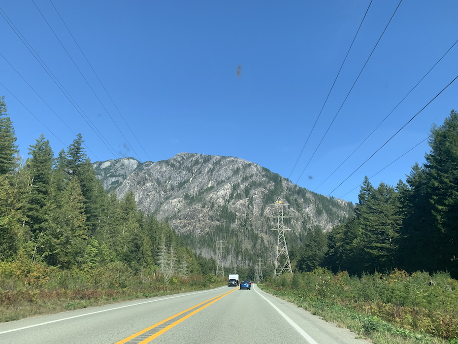
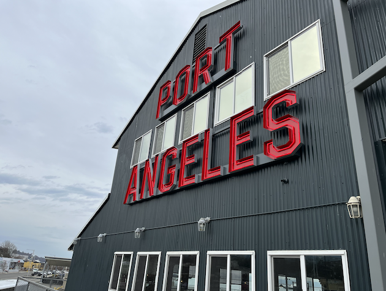
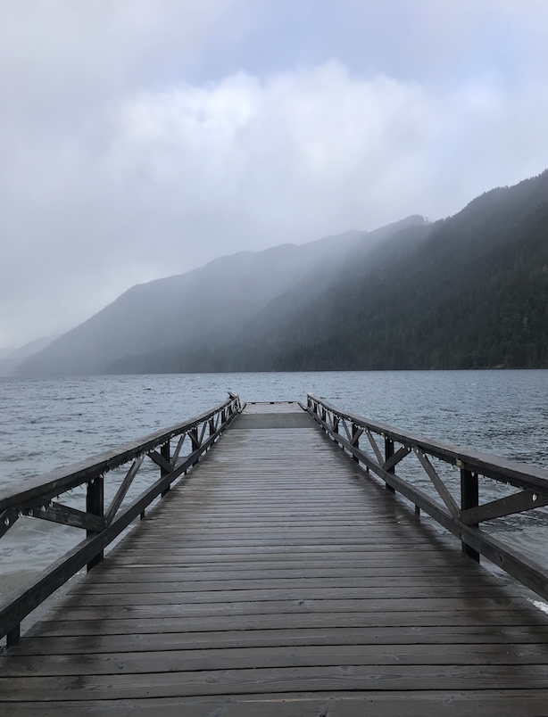
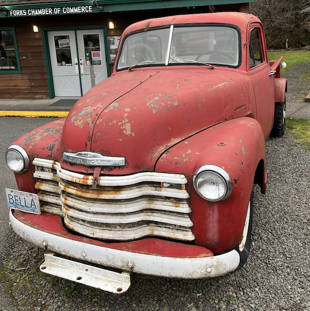
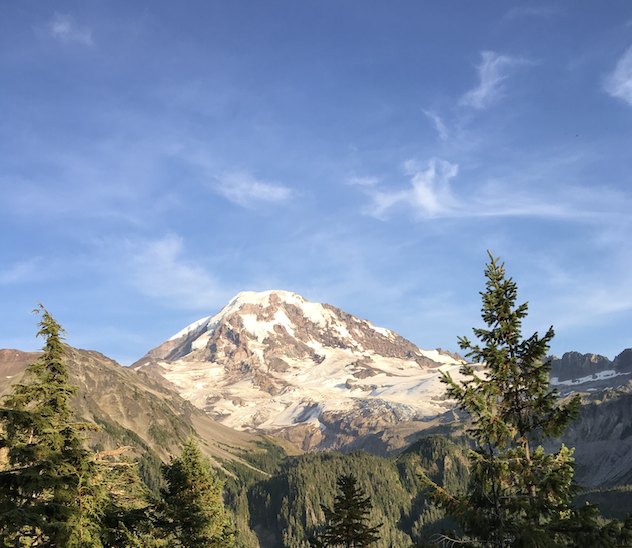
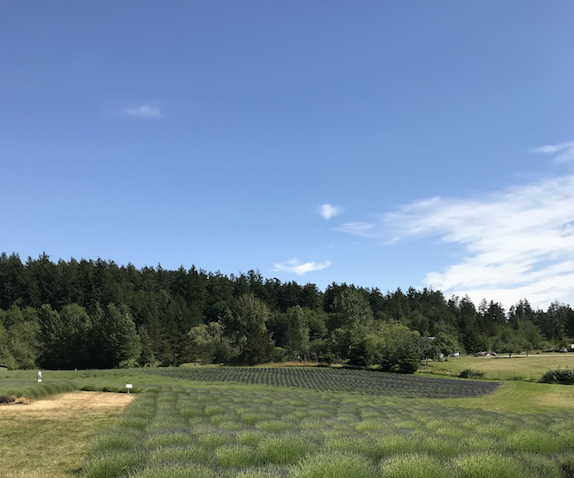
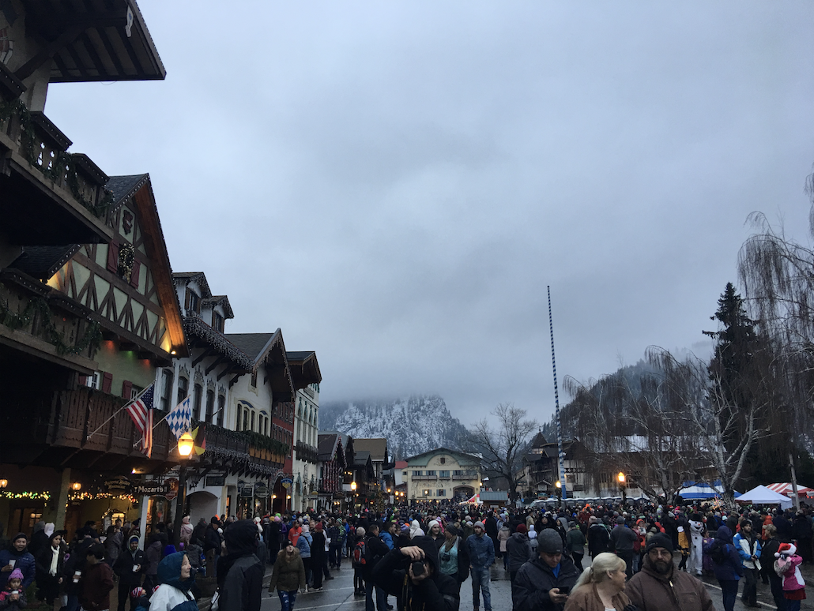
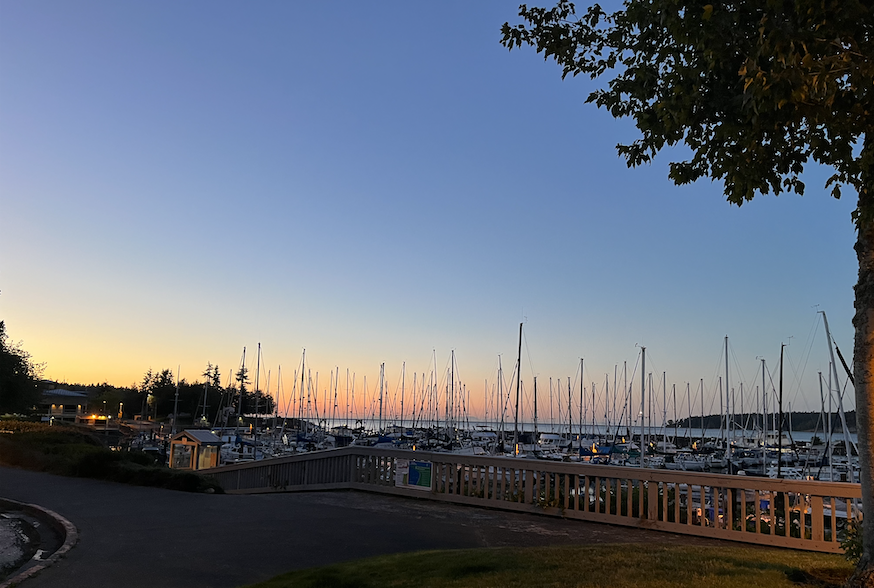

# Where Did I Get My Images?

The stunning visuals that bring our image processing examples to life aren't just random pictures; they're a tribute to the breathtaking beauty of Washington State. These images capture the essence of a region known for its diverse geography and inspiring vistas.

## Browns Point Lighthouse

*Standing guard over Puget Sound, Browns Point Lighthouse is a beacon of maritime history and a symbol of the region's nautical heritage.*

## Marble Mountain

*With its sweeping vistas and challenging terrain, Marble Mountain offers an exciting exploration ground for outdoor enthusiasts. Its peaks and trails are a tribute to Washington's rugged beauty.*

## Port Angeles

*A popular stop for ice cream enthusiasts, the windy Port Angeles Wharf serves as a gateway for travelers heading to Canada or Olympic National Park.*

## Lake Crescent

*Nestled near an elusive restaurant and a charming lodge, Lake Crescent offers breathtaking views and an escape into Washington's tranquil beauty.*

## Forks

*Home to the filming of Twilight, Forks presents a nostalgic scene with Bella's truck, capturing the spirit of the famous series.*

## Mount Rainier

*A majestic sight from the hiking trails, Mount Rainier's peak remains a distant wonder, its beauty inspiring awe without the need to conquer its summit.*

## San Juan Islands

*An early visit to San Juan Islands reveals a peaceful landscape, waiting for the lavender to bloom in the months to come.*

## Leavenworth

*A festive winter wonderland, Leavenworth recalls the times before the pandemic, filled with lively celebrations, beer, and sausage.*

## Sequim Bay

*With boats bathed in the soft glow of sunset, Sequim Bay offers a tranquil scene of coastal serenity.*

## Broadway

*Captured on a tranquil winter's day, this view of Broadway showcases a rare moment of calm on one of Seattle's busiest streets. Stretching all the way to Yesler Terrace, the image paints a peaceful contrast to the normally bustling avenue, offering a contemplative glimpse into the heart of the city.*

## Little Gray (My Cat)

*Meet Little Gray, my delightful cat. While not a Washington landmark, he's a cherished part of my world and adds a touch of whimsy to this collection of images.*
